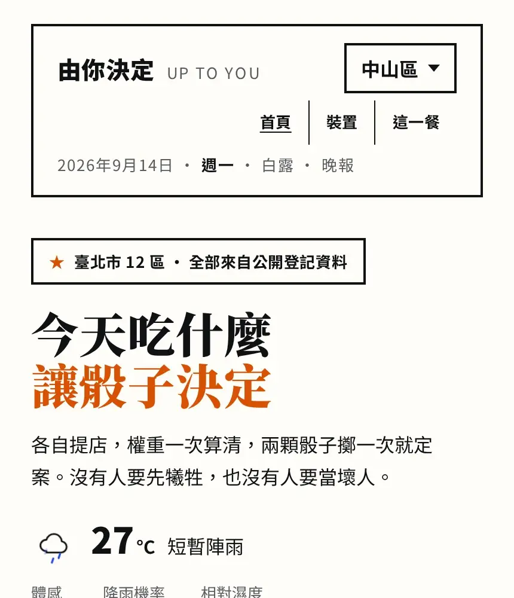
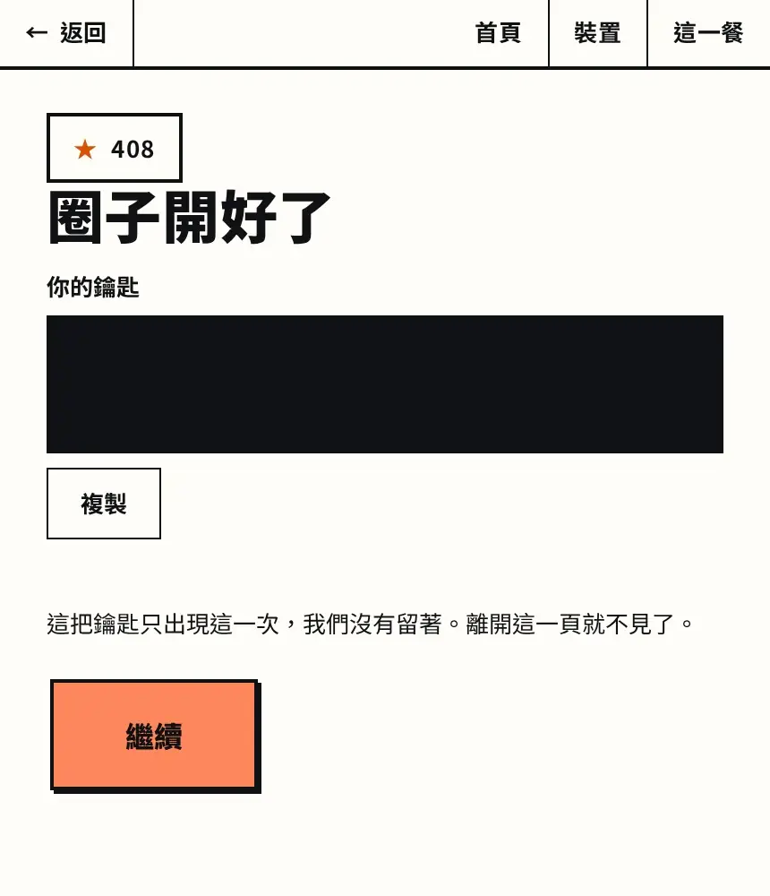
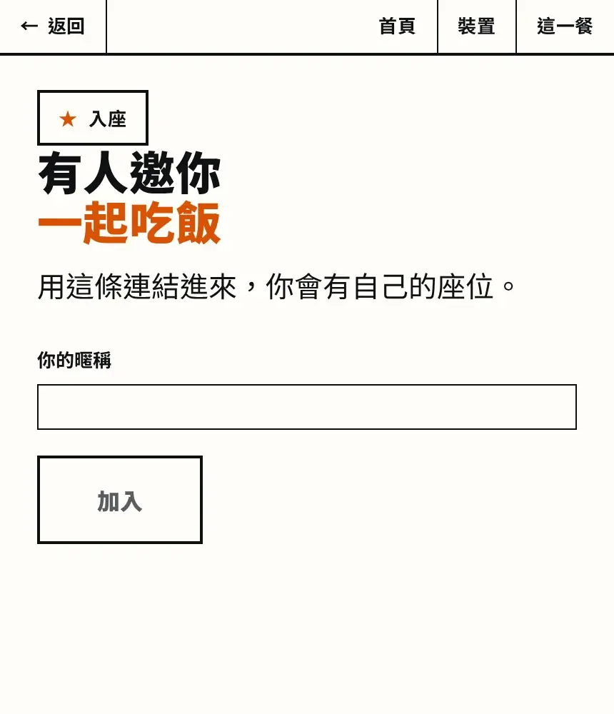
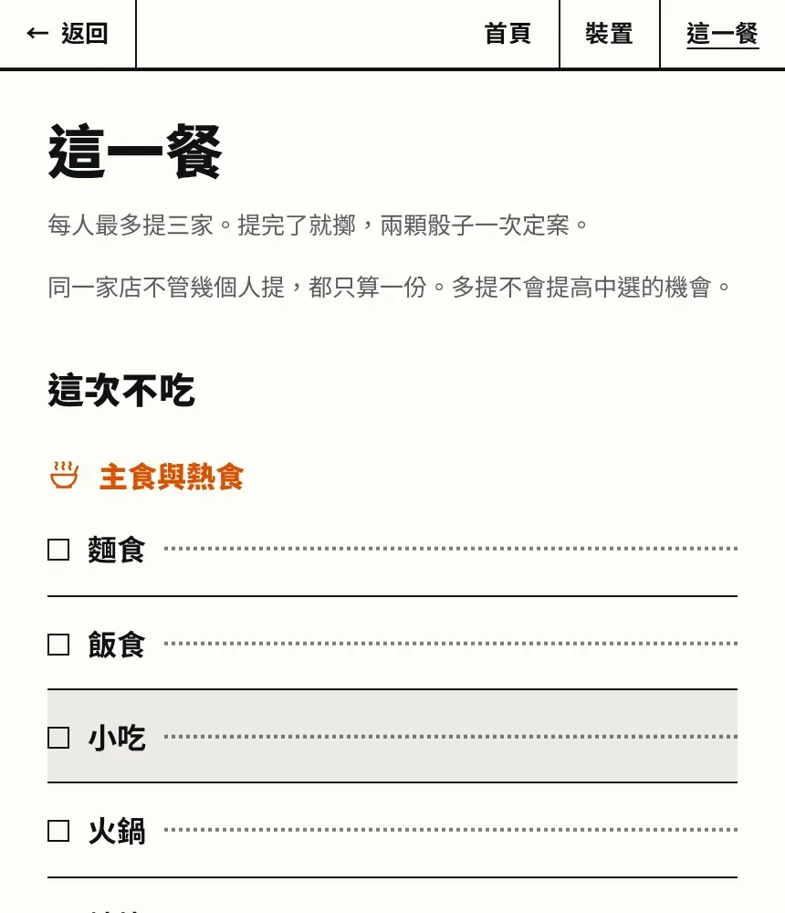
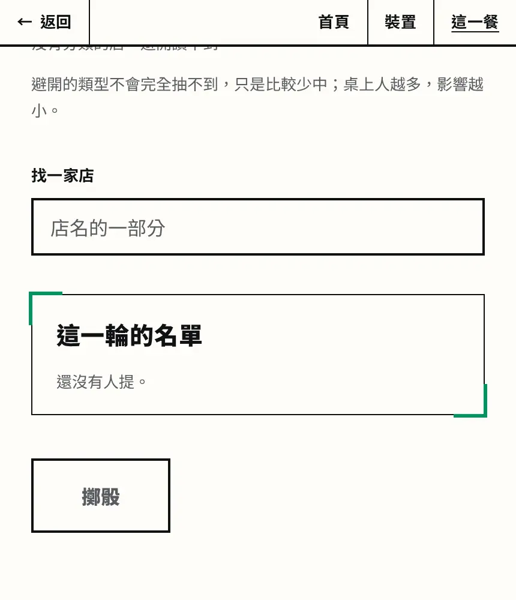
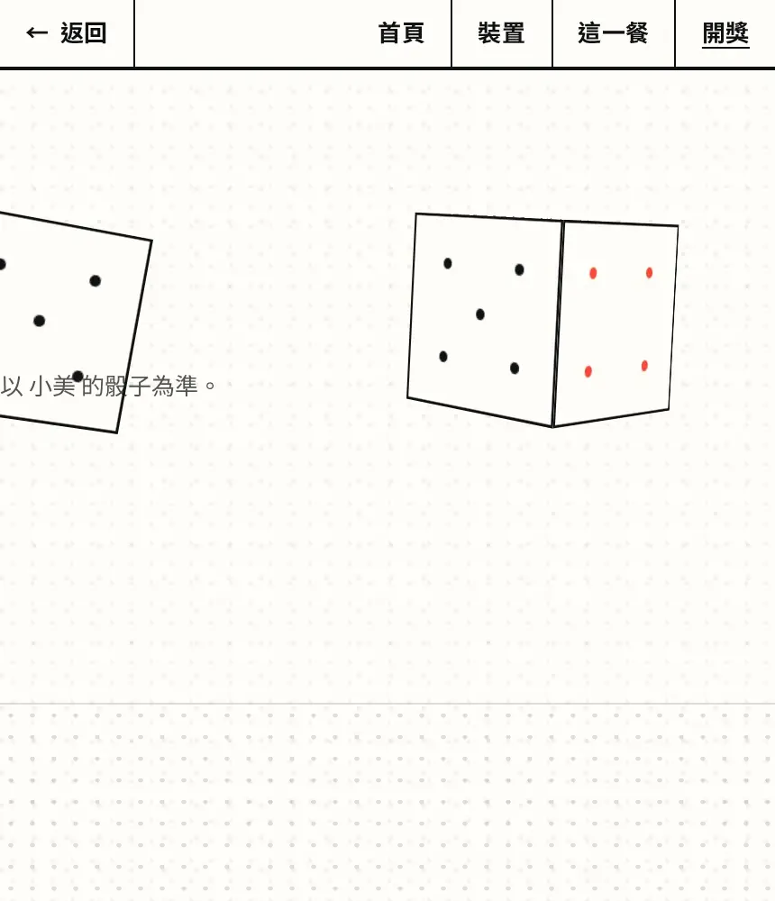

# Up to you

[English](README.md) | [繁體中文](README.zh-TW.md)

[](https://react.dev/) [](https://fastapi.tiangolo.com/) [](https://www.postgresql.org/) [](https://github.com/pgvector/pgvector) [](https://airflow.apache.org/) [](https://ollama.com/) [](#data-source-and-data-model) [](#system-architecture)

**A group decides one meal together, and a weighted pair of dice does the choosing.**

It is for a small group that cannot agree where to eat. The app picks a place and shows why that
place won.

**Try it: [uptoyou.jacksong-tw.com](https://uptoyou.jacksong-tw.com)**

Open it, create your own circle, share the link with friends. To run it yourself, see Quick start at the end.

*This English page is canonical: where the two languages disagree, this one is right.*

## Project Snapshot

| | |
|---|---|
| **The idea** | A few friends want one meal, nobody wants to be the one who chose, so the app chooses and shows its work |
| **How it decides** | Weighted dice, not a ranking: every factor multiplies a place's odds, and every factor is stored with the reading it came from |
| **Data scale** | Seven government sources, six scheduled ingests, `35,965` Taipei places (`25,031` categorised), a `224 MB` database |
| **Technical focus** | content-addressed ingest with an idempotent run log, a three-step name derivation, a retrieval-augmented classifier scored on a frozen set |
| **Measured** | Four local models on one frozen set: `72.0` · `71.0` · `70.5` · `65.5`; a no-change ingest `1.6 s` against `15.0 s` to store; the whole city classified in `10.5 h` |
| **Tech stack** | FastAPI / PostgreSQL + pgvector / Airflow / React 19 + Vite + Tailwind / nginx / Docker Compose / AWS EC2 / Cloudflare / Ollama |

## Feature Demo

One meal, from an empty circle to the dice, in six steps. Each clip is silent and short.

**1. Create a circle.** No account: open the site, name the circle, pick your nickname, and it exists. The seat lives in this browser, with no email and no password.



**2. Share the invite link.** One link seats anyone who opens it, up to ten seats; it lasts an hour, and a new one replaces it (blacked out here).



**3. A friend joins.** They open the shared link, pick a nickname, and get a seat.



**4. Say what not to eat this time.** Each member marks the kinds of food to avoid for this meal.



**5. Propose, then roll.** Everyone proposes up to three places; one roll of two dice settles it.



**6. See the result.** The dice land on the winner. Every member sees the same winner, the dice and the whole pool; the weights behind the odds are on the operator's view.



## What problem is this project solving?

### 1. Nobody wants to own the choice

A few friends want dinner. Everybody has a mild preference. Nobody wants to own the decision. So the
group follows the loudest voice, or spends twenty minutes not choosing.

### 2. A ranking only moves the argument

The usual software answer is a ranking. That only moves the argument. Now the group argues about
whether the ranking is right, and whoever picks from it still owns the choice.

### 3. It is a recommender, and the last step is the one that differs

Under the surface this is the shape every recommendation system has:

| Step | Here |
|---|---|
| **Sources** | Seven government sources on their own schedules, landing in one database — the hard part is making them agree, joined on 統編 and 登錄字號, never on fuzzy string similarity |
| **Features** | At the moment of the roll, per place and per round: its generated category, whether anybody at the table avoids that category, the rain probability in that township at the meal's hour, whether last night's signed trip went there |
| **Scoring** | Each feature returns a coefficient, the coefficients multiply, and the product is the place's weight |
| **Selection** | Weights become integer shares of the 36 outcomes, and a seed committed before the first proposal picks one |

**Two things are deliberately not what an ad or a shop recommender does.**

**The scoring is written, not learned.** A trained scorer needs a ground truth — what people actually
chose — and this product has none: no circle here has a member who is not a test identity. A model
fitted on nothing cannot be validated, and an unvalidated model is worse than a rule that states its
reason. So the three constants are policy: ×0.5 for the place the group went to last time, 1/N for a
category one person avoids, ×0.8 for a wet hour.

**The last step samples instead of taking the top.** A recommender scores and then returns the best
few. This scores and then draws. A place with more weight holds more of the 36 outcomes and is
likelier, never certain — so what the reveal shows is a **selection probability, not a
recommendation score**. That is the whole difference between «the system thinks this is best» and
«under tonight's conditions, this one had the best chance».

## Why weighted dice?

Dice are fair by construction: nobody picked, so nobody has to defend the pick.

Plain dice ignore everything the group knows, so the dice are weighted. Two dice have 36 outcomes,
each place holds some of them, and what people care about changes how many it holds.

A category somebody avoids is a **discount, not a veto**, and the discount is proportional to the
table: with N at the table, one objection costs a place 1/N of its odds. With 5 at the table it loses a
fifth and stays reachable. At N = 1 the objection is a veto — a round of one person was that
person's decision anyway.


A weighted die is worth trusting only if the weights can be checked. Every factor is written as a row
at the moment of the roll, linked to the reading it was computed from, and nothing is recomputed for
display: the reveal reads the same rows the roll used.

**Who sees what.** A member sees the winner, the dice and one line. The full table — every factor and
the row it came from — is the operator's view. The difference that matters is «take our word for it»
against «it can be checked». A preference is private on the way in and visible on the way out: what
moved the odds is shown, and who asked for it is not.

**And privacy is enforced in the database.** Closing a round
fires a trigger that nulls `proposal.member_id`, in the transaction that makes the result durable —
a manual close over SQL or a fix-up script would each leave authorship behind, and neither would
error. A preference write returns 204 and emits **no event at all**, because in a small circle the
moment of an event is one guess away from a name. Preferences are per meal unless kept, and a
nightly job erases them under a role that can read and delete that one table and nothing else.


## How Up to you approaches it

Each factor multiplies a place's share of the thirty-six outcomes. The factors are stored when the
roll happens, and the reveal reads them back.

| Factor | What it does to a place's odds | Why |
|---|---|---|
| Rain over its district | Lowers them, relative to the driest district in tonight's pool | Walking somewhere in the rain is a real cost. It is a fact about tonight; the place itself does not change |
| The circle went there last week | Halves them | Variety, without removing the option. Only a signed trip counts, so a place the group merely rolled is untouched |
| Somebody avoided its category | Lowers them by 1/N, where N is the seats at the table | A discount. One objection among five seats weighs less than one among two |
| Nothing applies | Leaves them alone | The starting weight is 1. A factor that did not fire still draws an empty row on the reveal |

## Project Highlights

- **35,965 places** from seven published government sources. Each fetch is content-addressed, so an
  unchanged file costs nothing.
- **A classifier scored on a frozen 200-row set.** Four local models were compared on it: 72.0 ·
  71.0 · 70.5 · 65.5.
- **Every factor is a stored row**, linked to the reading it was computed from. The reveal reads
  those rows back rather than recomputing anything.

## Terminology and Data Units

| Term | What it means here |
|---|---|
| **Circle** | A standing group of people who eat together. |
| **Member** | One person's seat in a circle. There is no account and no email, only a device token. |
| **Round** | One meal being decided. It opens, collects proposals, and closes on a roll. |
| **Proposal** | A place somebody put forward in this round. |
| **Roll** | Two dice, weighted by the round's factors. One roll counts, named before the dice are seen. |
| **Reveal** | The screen after the roll: the winner, and every factor that moved its odds. |
| **Contribution** | One stored factor: what it multiplied by, which contributor produced it, and which reading it came from. |
| **Place** | A restaurant. Either a row from the published reference list, or one a circle added itself. |
| **Publication** | One fetched file, identified by the hash of its bytes. Never overwritten. |
| **Ingest run** | One attempt at one source. Records what happened, including «nothing had changed». |
| **Name ladder** | How a display name is chosen: storefront sign, then brand, then registered name. |
| **Category** | One of thirteen closed values a place can be classified into. |
| **Crib** | The labeled examples retrieved from the vector store and handed to the classifier as worked examples. |

## Performance and Optimization Results

**None of these came from tuning a parameter.** Every row is the same question answered twice: does
this work need doing at all, and does it need doing here?

| What | Before | After | Measured on |
|---|---|---|---|
| An ingest day with no new file | 15.0 s | **1.6 s** | the run log, 8 days, 7 sources |
| Embedding one name for the example set | 0.481 s | **0.045 s** | 100 names, twice, 09-04 |
| Classifying one name | 12–19 s on the CPU | **1.27 → 0.92 s** on an 8 GB card | one district, 1,318 rows |
| The registry roster ingest's peak memory | 172 MB | **77 MB** | a 2 GB instance, 09-05 |
| The serving stack at rest | 1,131 MiB | **1,009 MiB** | a 2 GB instance, 09-07 |
| A long classification pass | 1.7× slower first-to-last | **level** | 36,014 rows in 10.5 h, 09-03 |

The memory figures were taken on a 2 GB instance. The instance has since been resized. [The long
version](docs/decisions.md) has the working for the last four.

## System Architecture


*One host, one compose file, and one database doing both the relational and the vector work, so
every service fits on a small cloud instance. Cloudflare terminates TLS at the edge, and the origin
answers with its own certificate. The four Airflow services and the API share one PostgreSQL. Each
connects as its own role.*

| Layer | What runs |
|---|---|
| **Front end** | Vite + React 19 + Tailwind 4 + shadcn/ui, built inside the proxy image. No CDN and no runtime fetch. Two subset fonts ship with the bundle. |
| **API** | Python, FastAPI, SQLAlchemy 2.0, async end to end, 47 hand-written Alembic migrations. |
| **Database** | PostgreSQL 17. Seven login roles, one per boundary: the API, the ingests, the nightly erasure, the backup, the lineage tool, the value checks, and the owner. Only the one-shot migration container ever holds the owner role. |
| **Vector** | pgvector, in that same database. |
| **Orchestration** | Apache Airflow 3, LocalExecutor, in the same compose stack. Its metadata is a second database in the same PostgreSQL. |
| **Models** | Ollama on a home box's 8 GB card, used in batches from the development machine; the production host runs no model. `gemma2:2b` generates, `snowflake-arctic-embed2` retrieves. |
| **Deployment** | One EC2 instance in Tokyo behind Cloudflare in Full (strict). It pulls images from a public registry and builds nothing. |

## Data Source and Data Model

### Data Sources

**Nine scheduled jobs, and the order is part of the design.** The five daily sources are staggered
twenty minutes apart so that two of them never compete for a small machine's memory; the two
deletion jobs run *before* the backup, so a dump never carries a row the product has already
forgotten.

| Schedule (UTC) | Taipei | Source |
|---|---|---|
| hourly | hourly | CWA township forecast `F-D0047-061` + station observations `O-A0001-001` |
| `0 19 * * *` | 03:00 | 食藥署 食品業者登錄, the restaurant reference list |
| `20 19 * * *` | 03:20 | 臺北市食材登錄平台, company ↔ brand pairs |
| `40 19 * * *` | 03:40 | 臺北市餐飲衛生分級評核, the sign an inspector saw |
| `0 20 * * *` | 04:00 | 商業登記-餐館業, which registrations are dead |
| `20 20 * * *` | 04:20 | 財政部 全國營業(稅籍)登記, tax name + industry code |
| `0 21 * * *` | 05:00 | deletes every per-meal preference row that no roll linked to |
| `40 21 * * *` | 05:40 | deletes weather readings older than ninety days that no roll linked to |
| `20 22 * * *` | 06:20 | `pg_dump` to S3 after both deletions; the last thirty are kept |

[The long version](docs/decisions.md) lists what each source stores and the thirteen categories. It
says how an answer outside them is refused, and how the frozen evaluation set was drawn.

### Data Size

The production database is **224 MB** on disk. It holds 35,965 places, 25,031 of them with a
generated category, and the 36,376 rows of the reference list this instance loaded.

### ETL Flow


**A fetched file is identified by the hash of its bytes, not by a timestamp** — content addressing,
the way a commit is named in git. A timestamp can change while the data stays the same, and stay the
same while the data changes. The reference ingest hashes a 17 MB zip and claims that hash with
`insert … on conflict do nothing returning id`: an id comes back and the 99 MB CSV inside is
decompressed, or nothing comes back and the run stops there.

**This is not an upsert.** An upsert writes either way, and it has to parse the file before it knows
what to write. Here the conflict *is* the answer — the content is unchanged, so the parse is skipped
entirely: 1.6 s on a no-change day against 15.0 s to store. And the claim is one statement, so two
runs starting together cannot both decide the file is new; a `select` first would let both through.

Every attempt writes a row to the run log, so «no change» and «failed» are two recorded outcomes
rather than two absences. Without that distinction, a broken source looks healthy for a week.

### The Schema at a Glance


*Thirteen tables of thirty-four, no columns shown. Every arrow out of `weight_contribution` links one
weight to exactly one source row.*

### Core Tables

| Table | Rows | What it holds |
|---|---|---|
| `place` | 35,965 | a place a circle can choose |
| `reference_place` | 36,376 | one row of the government reference list, as published; the count is the publication this instance loaded, and the name-ladder table measures that same publication |
| `storefront_name` | 1,686 | the sign an inspector recorded |
| `brand_registration` | 288 | company ↔ brand pairs |
| `business_tax_row` | 72,801 | tax-registry name and industry code |
| `business_status_row` | 209,472 | business-registration status |
| `forecast_reading` | 195,280 | township forecast readings |
| `observation_reading` | 26,847 | station observation readings |
| `ingest_run` | 351 | one record per ingest attempt, including «no change» |

Counts measured on the production instance.

## Key Technical Decisions

Most of the work is in building the list of places to choose from.

### 1. Names: cleaning, parsing, and the real difficulty

**The difficulty.** The government's restaurant list says 安心食品服務股份有限公司. You know it as
摩斯漢堡. Same company, two names, and only one of them means anything to a person choosing dinner.
40.2% of registered names are legal-entity strings that name no shop at all.

**The approach.** A display name is resolved down a ladder: the sign an inspector recorded, then the
brand, then the registered name. Three sources are joined by registry number, with fixed precedence
and no fuzzy name matching. Turned down: the registered name alone; string similarity across
sources. Overture Maps, the open global places dataset, was tried and dropped: 39.5% trustworthy matches, 46% false joins on address alone.


**The result.** The sign differs from the registered name on 93% of the rows that have one. The
brand table renames 57% of the companies it covers. How far the ladder reaches, over the
36,376 rows of the current publication:

| Step | Rows | Share | Of those, still names a company |
|---|---|---|---|
| sign (site-level) | 1,363 | 3.7% | 3.2% |
| brand (single-brand companies only) | 4,003 | 11.0% | 44.2% |
| registered (what is left) | 31,010 | 85.2% | 32.9% |

The ladder reaches 14.8% of the city. 33.1% of all rows still display a string that names a
company. Where a sign exists the name is right.

### 2. Categories: RAG

**The difficulty.** No published source says what a place serves. There is no official field for
«this is a noodle shop». So the category is generated. A local model reads the best name the project
holds and picks one of the thirteen categories. Its accuracy is measured on a frozen set.

**The approach.** RAG, in three steps:

- **Retrieval** — pgvector finds the five most similar already-labelled names.
- **Augmented** — they go into the prompt as worked examples, with the name to classify.
- **Generation** — the model answers with one of the thirteen categories.

Labeled example names are embedded into pgvector, and that is the example set. Missing knowledge is
added as data, leaving the prompt and the weights alone. Turned down: another prompt revision;
fine-tuning.

**Why the model is local.** The scheduled pass runs `gemma2:2b` for the answer and
`snowflake-arctic-embed2` for the neighbours, both on the same box as the database, batch-only, off
unless a backfill runs. Three reasons not to call a hosted API instead: the free tier allows 500
calls a day, so 3,300 places take seven days against one night locally; the names never leave the
machine that holds them; and classification is a nightly batch, so latency buys nothing. A hosted
model is kept as a baseline — it read 60.5% on the first frozen set, which is not comparable to the
table above, because the set changed.


*The same 200 frozen rows, one round per model, scored and never re-run.*

**The result.** The prompt revision *lost* points on the frozen set (51.5 → 49.5). Retrieval on the
same set moved `gemma2:2b` 51.5 → 61.0 and `llama3.2:3b` 37.0 → 58.0. `qwen2.5:3b` went
51.0 → 48.5. The same example set reads as noise to one model, which is why each pairing is
measured.

*The current table:* prompt v7, thirteen categories, `testset_v3`, the same example set
(`snowflake-arctic-embed2`, five neighbours). Every round ran on the home box, through the same relay
the scheduled pass uses:

| model | licence | pooled accuracy (200 rows) |
|---|---|---|
| `qwen2.5:7b-instruct` | Apache-2.0 | **72.0%** |
| `gemma2:2b` | Gemma terms | 71.0% |
| `llama3.2:3b` | Llama 3.2 community | 70.5% |
| `qwen2.5:3b-instruct` | research licence, evaluation only | 65.5% |

Three models sit inside two points of each other, and one of them costs three times as much per row.
The scheduled pass kept `gemma2:2b`. The hosted model read 60.5% on the first set only.

*The embedder was screened the same way* — kNN-1 on `testset_v3`, leave-one-out, the neighbour's own
label taken as the answer:

| embedder | kNN-1 accuracy |
|---|---|
| `snowflake-arctic-embed2`, bare | **55.0%** |
| `snowflake-arctic-embed2`, with its own `query:` prefix | 53.5% |
| `e5`, with `query:` | 51.5% |
| `0.6b`, with an instruction | 51.5% |

Nothing beat the incumbent, and the incumbent was best **bare**: the card's own prefix costs 1.5
points. `qwen3-embedding:4b` could not be screened at all — it returns 2560 dimensions against a
`vector(1024)` column, and the column was not widened for a candidate that had not won anything. The
neighbour count was screened on the same set and settled at five.

### 3. What the official industry codes can decide

**The difficulty.** The tax registry carries an industry code per registration. A coffee chain's 245
branches register under a wholesale code, so a code alone would mislabel every one of them.

**The approach.** The codes rule where unambiguous, and the model takes the rest. Turned down: codes
as the classifier; ignoring codes entirely. The join itself is safe: 99.78% of names agree once the
legal-form suffix is stripped. The address is unsafe as a join key: 89.8% differ.

**The result.** Codes settle 10.9% of city rows, one row in ten. [The long
version](docs/decisions.md) measures the same question on the 200 scored rows. There the defensible
upside is +4 rows.

### 4. Ingest: content-addressed, with a run log

**The difficulty.** A timestamp can change while the data stays the same, and stay the same while
the data changes. And if «no change» is only inferred from a missing row, a broken source looks
healthy for a week.

**The approach.** One row per fetched file, a data row per record, and a run log where a no-change
day writes a heartbeat. Turned down: overwrite-in-place; schedules guessed to match each file's
cadence.

**The result.** Every source is idempotent on identical bytes. That was proven by running each one
through its real command-line entry point twice and comparing every column of every table. On the
reference source the no-change path takes 1.6 s and a store takes 15.0 s. Per source, a no-change day runs 0.31–3.58 s and a store
0.31–25.03 s.

*Measured on the schedule itself*, 8 days, 332 run-log rows against 361 Airflow task instances.
Nothing was instrumented and no column added:

| Source | Store p50 | No-change p50 | Run-log rows |
|---|---|---|---|
| CWA township forecast | 2.99 s | 1.85 s | 149 |
| CWA station observation | 3.09 s | 0.31 s (n=1) | 149 |
| FDA 餐飲場所 reference | none yet | 1.88 s | 5 |
| 食材登錄 brands | 0.57 s | 0.96 s | 8 |
| 衛生評核 signs | 0.31 s | 0.43 s | 7 |
| 商業登記 status | 25.03 s | 2.09 s | 7 |
| 營業稅籍 registry | 12.95 s | 3.58 s | 7 |

**The no-change day is 3.6× cheaper than a store on the largest source**, and 12× cheaper on the
registry roster. That is what the claim-before-parse short-circuit saves. **Orchestration costs a
flat 1.2 s a task**, whether the source takes half a second or twenty-five. **The scheduler is not
the bottleneck.** Queue latency is 0.05 s at p50 and 4.2 s at its worst across all 361 tasks. None
of this measures the fetch / parse / store split, because nothing records it.

### 5. Observability

**A live product has to say two things about itself: «I am still here» and «I can still hear the
database».** Both are answers to the same failure — something is quietly not working and nothing
says so.

- **«I am still here» is a comment line every 25 s.** The proxy in front cuts a stream that has been
  silent for 130 s, and a cut stream delivers nothing afterwards while looking exactly like a quiet
  evening. The heartbeat is what keeps the silence from being ambiguous.
- **«I can still hear the database» is what `/health` answers.** Each API process holds one listening
  connection and fans events out from it, so more than one instance can serve one circle. When that
  connection dies the process says so: 503 with the time it went down, reads still served. Measured
  on a real kill: **503 within 0.18 s, back on a new connection within 1.23 s.**

### 6. Reliability

**Reliability here does not mean «it will not break». It means that when it breaks, the error shows
up in the right place.** Three ways to break, three places:

- **A wrong deploy → the error stops at the deploy, not at a member.** An API process reads the
  migration revision at startup; if the database is behind, ahead, or never migrated, it logs both
  revisions and exits. The thing that fails is that container, not somebody's request.
- **A slow dependency → one number, instead of one slow evening.** The model is not held in the
  card's memory, so the first request of the day waits ten-odd seconds while it loads — and from the
  calling side, «loading» and «the machine is down» look identical. So the retry count is printed:
  first request fails, the retry twelve seconds later answers in half a second, and those three
  numbers say «cold start», not «flaky all night».
- **The alert channel itself → tested by a job that fails on purpose.** A failed scheduled task
  sends one message carrying the log's path inside the container and never a URL (alerting is off
  in a fresh clone by design). «No alert» and «alerting is broken» look the same from the outside,
  and waiting does not tell them apart.

Idempotence is decision 4's, and the test counts are in «Six more decisions» below.

### Six more decisions

- **Vector search is a Postgres extension.** The example set is 537 rows across three embedders. A
  second service would be one more stateful thing to run, back up and monitor.
- **The evaluation set is frozen, stratified, and its authorship is stated.** It caught a prompt that
  read better and scored worse.
- **Substring search stays a sequential scan.** A trigram index — one that cuts every string into
  three-character pieces and indexes those — changed the plan for 0 of 31 realistic queries. The real
  cost was a sub-query re-run once per candidate row, 35,533 times per keystroke.
- **The small instance was too small for its own nightly work.** 49 MB free under one ingest became
  398 MB in the worst case. The stack went 1,131 → 1,009 MiB at rest.
- **The cloud serves; the home box computes.** An 8 GB card takes a retrieval-shaped batch at 0.92 s
  a name. The same box's CPU takes 12–19 s.
- **The nightly backup is drilled, not assumed.** A 19.7 MB dump finishes in 3.7 s and restores into
  a fresh database in 9.4 s, with the row counts equal.

**The suite is 74 test files in two tempos**, and every commit passes six local gates. Host-side
tests need no network and no database; build-and-drop tests build their own database inside the one
service that holds the owner's credential. Five of the six gates are standard-library only, so a
clone needs no toolchain to commit.

[The long version](docs/decisions.md) has each of these in full.

## Development Journey

| Dates | Phase | What changed | The number |
|---|---|---|---|
| 08-11 to 08-17 | Skeleton and the architecture walk | The stack boots from one compose file. The destination, the batch classifier and its stop-loss ladder were settled one at a time. First evaluation rounds on a fixed set. | prompts v3 → v5 in two days; v5 with retrieval scored **66.0%** on a 200-row set drawn once |
| 08-18 | The front end reversed | The hand-rolled, no-build front end was replaced by Vite + React 19 + Tailwind 4 + shadcn/ui, built inside the proxy image. | one night to re-decide; the served bundle still fetches nothing at runtime |
| 08-19 to 08-29 | The engine's factors, and the screens that show them | Every member rolls and one roll counts, named before the dice are seen. The rain factor was made relative to the pool's driest district. «Last time we went here» halves a place. The ingredient veto was built, measured and withdrawn for want of coverage. | rain: gap ÷ 120, floored at 0.5; ingredient coverage 12.4% of places, which is why the kind left the product |
| 08-29 to 08-31 | The screens frozen | The return-choice screen. An eleventh, then a twelfth and thirteenth category. The nightly S3 backup with a restore drill. | drill: 19.7 MB dumped in 3.7 s, restored in 9.4 s, counts identical |
| 08-30 to 09-02 | The classifier ladder | A 7B model was admitted once the comparison ran on the machine the pipeline actually calls. Prompts v6 and v7. The test set relabelled twice. The whole city re-decided. The per-model unload that removed a slowdown. | four models on one set: 72.0 · 71.0 · 70.5 · 65.5; 36,014 rows in 10.5 h with five level curves; 其他 down 38% |
| 09-04 | The design round | The tonight screen as a menu with section marks, and one slim bar on every inner screen. The reveal's chrome reduced. Connection and rate limits on the proxy. A 25 s heartbeat on the live stream. | a stream silent for 130 s: cut through the proxy, open direct; with the heartbeat, open and delivering |
| 09-04 to 09-07 | Launch on EC2 | One small instance in Tokyo boots the public extract and passes one ingest cycle the same day. The box wedged twice on memory. The roster ingest now streams the file; it no longer holds it whole. TLS terminated in the existing nginx with an Origin CA certificate. Cloudflare live in Full (strict). | 49 MB available under one ingest → 398 MB worst case after. The roster 172 → 77 MB. The stack 1,131 → 1,009 MiB at rest. A health check that cost 7.4 s of CPU every 20 s, gone |
| 09-08 | Images from a registry | Seven image names collapsed to three. Images are built here and pushed to a public registry, tagged with the extract's commit. The box pulls that tag and builds nothing. | pull 9 s; memory 479 → 664 MB during the deploy, never dipping |
| 09-11 | More than one instance | The event bus moved into the database, so two API processes can serve one circle. The schema step left the boot, so instances cannot race one migration. Each process's listening connection is supervised and reported. | a listener killed from the database side: 503 in 0.18 s, reconnected in 1.23 s |

## How it was built

**The thing that makes seven sessions work is not the split — it is that nobody checks their own work.** One developer directs seven Claude Code sessions; each has one job. The tooling behind them (the commit hooks, the project skills, the planning documents) lives in the private development repository; this public extract carries the product alone.

| Session | Its one job | What it may change |
|---|---|---|
| Coordinator | Turns every open question into one recommendation, its cost and the option it rejects, for the developer to decide; keeps the decisions and the plan | the planning documents |
| Backend | The API, the database, Airflow, the tools | `api/`, `airflow/`, `db/`, `compose.yaml`, `evaluation/` |
| Frontend | The screens and the proxy | `web/`, `proxy/` |
| Code reader | Reads every backend change before it ships, without seeing how it was written | its own reports |
| Page tester | Measures the served page and the API before a change ships, as each kind of visitor | its own reports |
| GPU box | Runs the models and the long batches on a home graphics card | its own machine |
| Research | Reads how others solve a problem, from dated sources | its own notes |

- **Questions reach the developer through one session,** always as a recommendation, what it costs, and what was rejected.
- **Backend changes are read twice.** A backend change ships only after the code reader's report and the page tester's measurement; a screen change after the page tester's. The code reader found a race that let an eleventh seat into a ten-seat circle; the fix is a row lock, and `api/tests/test_self_serve_integration.py` races two joins on separate connections to prove it.
- **File ownership.** Each session commits only the paths it owns, named one by one.
- **Checks before commit.** Six checks run before every commit, among them a secret scan, a lint, and a check that every character on a screen exists in the font the site actually loads.
- **Project skills** record what only needs learning once: running an evaluation round on the GPU box, and a design rubric for every screen.

## Limits and future work

**Taipei only**: twelve districts, one city's open data, with addresses normalised at the ingest
boundary because the same government file spells the city two ways.

**Every source is used inside its licence.** One whose licence is non-commercial or uncertain is not
used at all, and there are no ratings, no reviews and no scraped pages anywhere in the pipeline.

**Sized for one small group**, with live room state per process. It is a portfolio project, developed
in a private repository and extracted here after every merge, so the commit messages carry the
reasoning behind each change.

- **«Did you actually go?» is a transaction, not a self-report.** The honest source for a visit is a
  membership scan or a checkout, and Taiwan has established vendors of each kind — restaurant CRM and
  loyalty (Ocard), restaurant POS (iCHEF), reservations and waitlists (inline). **None is used here
  and none has been approached**; the note records that the road was looked at, not walked. Two
  things stand in front of it, and only one is technical: data of this kind moves under a commercial
  agreement, and Taiwan's PDPA makes purpose limitation the real question — a partner collected those
  records to run its own business, not so a third party could seed a dining app. Until then the
  product asks the group instead, which is cheaper and weaker.
- **素食 stops being a category and becomes an attribute** a place carries (素食麵館 = 麵食 + 有素).
  «I cannot eat here» is a hard requirement, so a discount does not fit it. The set returns to
  twelve.
- **More than one instance behind a load balancer**, now that the event bus is in the database and
  the schema step is a deploy step.
- **MLflow over the evaluation rounds**, replacing the round files' home-built bookkeeping.
- **A 超市 category and prompt v8.** The test set has to be re-cut first, or the new score cannot be
  compared with the current one.
- **Text-to-speech and speech-to-text rounds** for an introduction recording, scored the same way the
  classifier was. That means a fixed set, a licence check first, and a number per candidate.

## Quick start

```sh
cp .env.example .env                # names only — the comments state the shape of every value
docker compose run --rm migrate     # the schema, once per version
docker compose up -d --wait         # the stack
curl -s localhost:8080/health
#   {"status":"ok","database":"reachable","instance":"…","stream_listener":"up"}
```

**Two commands.** The schema step left the stack's boot, so that several instances cannot race it.
The migrate step is idempotent — run it on a current database and it does nothing.

**A fresh clone comes up empty, and then fills itself.** There are no places until the first
reference ingest runs — the scheduled job fetches them overnight, or
[run it by hand](docs/operations.md). **And places carry no category until the classifier backfill
runs**, which needs a machine with a graphics card. That is the one thing a clone does not fetch for
itself: without a card you get every place and no categories, which is a working product with one
column empty.

`localhost:8080` is the app; the API and the database are reachable only over the compose network.
The weather ingest needs a free CWA Open Data key (opendata.cwa.gov.tw), read once at init into a
Fernet-encrypted Airflow Connection, and the five open-data files need no credential. New scheduled
jobs arrive **paused**.

Running an ingest by hand, a classification backfill, the tests and the lineage tool:
[docs/operations.md](docs/operations.md).
