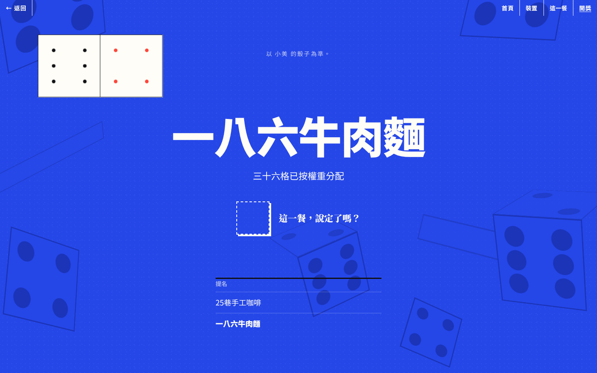
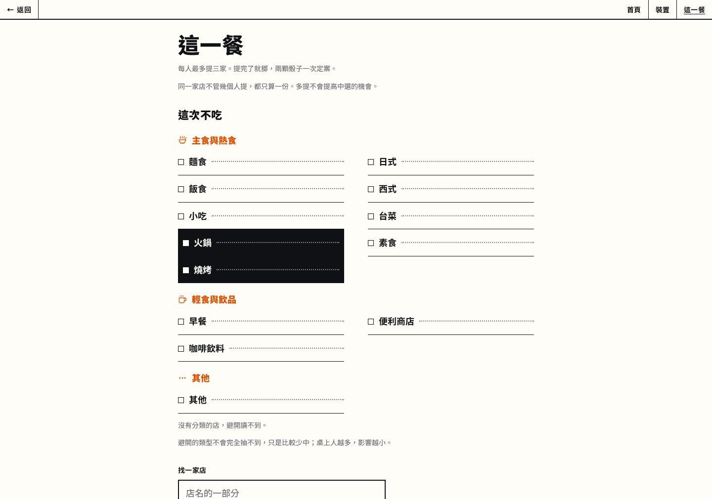
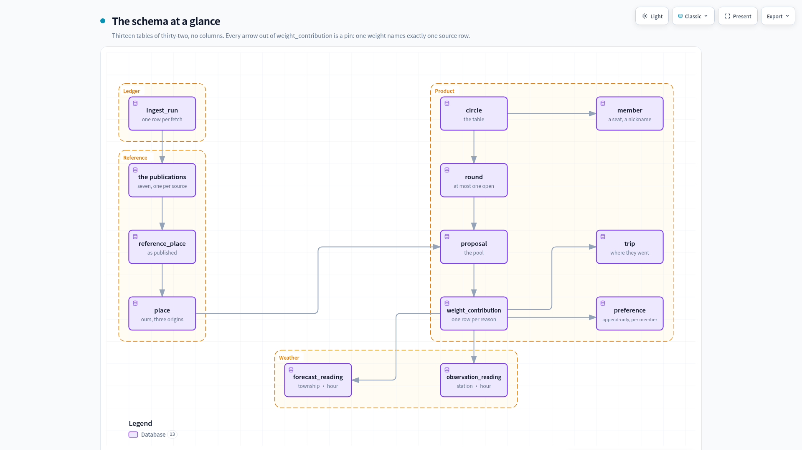
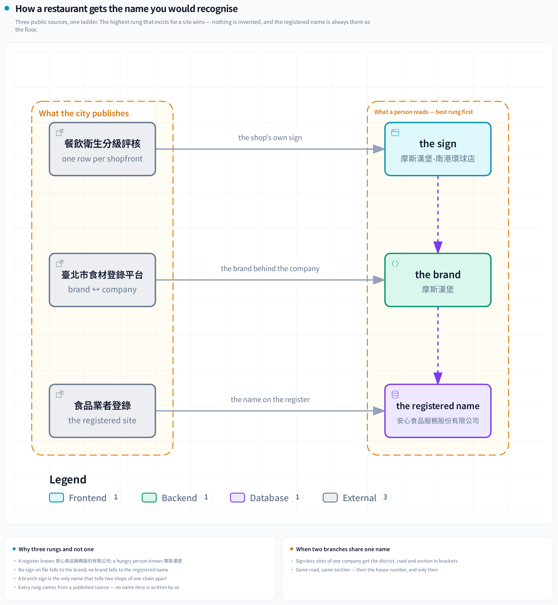

# Up to you

[English](README.md) | [繁體中文](README.zh-TW.md)

[](https://react.dev/) [](https://fastapi.tiangolo.com/) [](https://www.postgresql.org/) [](https://github.com/pgvector/pgvector) [](https://airflow.apache.org/) [](https://ollama.com/) [](#data-source-and-data-model) [](#system-architecture)

**A group decides one meal together, and a weighted pair of dice does the choosing.**

It is for a small group that cannot agree where to eat. The app picks a place and shows why that
place won.

**Try it: [uptoyou.jacksong-tw.com](https://uptoyou.jacksong-tw.com)**

### Try this round

```sh
docker compose run --rm migrate                          # the schema, once per version
docker compose up -d --wait                              # the stack
docker compose exec api python -m upto.issue 1 Kevin     # a device token, printed once
```

Open `localhost:8080`, paste the token, propose three places, roll.

*This English page is canonical: where the two languages disagree, this one is right.*

## Project Snapshot

| | |
|---|---|
| **The idea** | A few friends want one meal, and nobody wants to be the one who chose. The app chooses, then shows its work. |
| **How it decides** | Weighted dice, not a ranking. Every factor multiplies a place's odds. The reveal names each factor beside the number it contributed. |
| **Data** | Seven published government sources, six scheduled ingests. 35,965 Taipei places, 25,031 of them with a generated category. |
| **Engineering** | Content-addressed ingest with an idempotent run log. A three-step name derivation. A retrieval-augmented classifier scored on a frozen set. |
| **Measured** | Four local models on one frozen set: 72.0 · 71.0 · 70.5 · 65.5. A no-change ingest takes 1.6 s; a store takes 15.0 s. The whole city classified in 10.5 h. |
| **Why this stack** | One compose file. One database does both relational and vector work. Every service runs on a small cloud instance. |

## Feature Demo


What you can do:

- **Home** shows the circle, and tonight's round if one is open.
- **Device** takes a token once. The browser then remembers the circle.
- **Tonight (這一餐)** lists the categories to avoid tonight, laid out as a menu with section marks.
- **Round** is where members propose places, then roll.
- **Reveal** shows the winner's odds after the dice stop, itemised factor by factor.

## What problem is this project solving?

### 1. Nobody wants to own the choice

A few friends want dinner. Everybody has a mild preference. Nobody wants to own the decision. So the
group follows the loudest voice, or spends twenty minutes not choosing.

### 2. A ranking only moves the argument

The usual software answer is a ranking. That only moves the argument. Now the group argues about
whether the ranking is right, and whoever picks from it still owns the choice.

## Why weighted dice?

Dice are fair by construction. Nobody picked, so nobody has to defend the pick. That settles the
social problem.

Plain dice ignore everything the group knows. So the dice are weighted. Each place gets a share of
the thirty-six outcomes, and the factors move that share. A category somebody avoids is a
**discount, not a veto**. The size of the discount depends on how many people are at the table. With
N at the table, one objection costs a place 1/N of its odds. At N = 5 the place loses a fifth and
stays reachable. At N = 1 the objection is a veto, because a round of one person is that person's
decision.



A weighted die can only be trusted if you can see the weights. Every factor is a stored row, linked
to the reading it was computed from. The reveal recomputes nothing for display. It reads the same
rows the roll used and names each one.

So a member can check the result. Nobody has to take it on trust. A preference is private on the way
in and visible on the way out. The reveal shows what moved the odds. It never shows who asked for it.



## How Up to you approaches it

Each factor multiplies a place's share of the thirty-six outcomes. The factors are stored when the
roll happens, and the reveal reads them back.

| Factor | What it does to a place's odds | Why |
|---|---|---|
| Rain over its district | Lowers them, relative to the driest district in tonight's pool | Walking somewhere in the rain is a real cost. It is a fact about tonight; the place itself does not change |
| The circle went there last week | Halves them | Variety, without removing the option. Only a signed trip counts, so a place the group merely rolled is untouched |
| Somebody avoided its category | Lowers them by 1/N, where N is the seats at the table | A discount. One objection among five seats weighs less than one among two |
| Nothing applies | Leaves them alone | The starting weight is 1. A factor that did not fire still draws an empty row on the reveal |

## Project Highlights

- **35,965 places** from seven published government sources. Each fetch is content-addressed, so an
  unchanged file costs nothing.
- **A classifier scored on a frozen 200-row set.** Four local models were compared on it: 72.0 ·
  71.0 · 70.5 · 65.5.
- **Every factor is a stored row.** A member reads it on the reveal, linked to the reading it came
  from.

## Terminology and Data Units

| Term | What it means here |
|---|---|
| **Circle** | A standing group of people who eat together. |
| **Member** | One person's seat in a circle. There is no account and no email, only a device token. |
| **Round** | One meal being decided. It opens, collects proposals, and closes on a roll. |
| **Proposal** | A place somebody put forward in this round. |
| **Roll** | Two dice, weighted by the round's factors. One roll counts, named before the dice are seen. |
| **Reveal** | The screen after the roll: the winner, and every factor that moved its odds. |
| **Contribution** | One stored factor: what it multiplied by, which contributor produced it, and which reading it came from. |
| **Place** | A restaurant. Either a row from the published reference list, or one a circle added itself. |
| **Publication** | One fetched file, identified by the hash of its bytes. Never overwritten. |
| **Ingest run** | One attempt at one source. Records what happened, including «nothing had changed». |
| **Name ladder** | How a display name is chosen: storefront sign, then brand, then registered name. |
| **Category** | One of thirteen closed values a place can be classified into. |
| **Crib** | The labeled examples retrieved from the vector store and handed to the classifier as worked examples. |

## Performance and Optimization Results

| What | Before | After | Measured on |
|---|---|---|---|
| An ingest day with no new file | 15.0 s | **1.6 s** | the run log, 8 days, 7 sources |
| Embedding one name for the example set | 0.481 s | **0.045 s** | 100 names, twice, 09-04 |
| Classifying one name | 12–19 s on the CPU | **1.27 → 0.92 s** on an 8 GB card | one district, 1,318 rows |
| The registry roster ingest's peak memory | 172 MB | **77 MB** | a 2 GB instance, 09-05 |
| The serving stack at rest | 1,131 MiB | **1,009 MiB** | a 2 GB instance, 09-07 |
| A long classification pass | 1.7× slower first-to-last | **level** | 36,014 rows in 10.5 h, 09-03 |

The memory figures were taken on a 2 GB instance. The instance has since been resized. [The long
version](docs/decisions.md) has the working for the last four.

## System Architecture


*One host, one compose file. Cloudflare terminates TLS at the edge, and the origin answers with its
own certificate. The four Airflow services and the API share one PostgreSQL. Each connects as its
own role.*

| Layer | What runs |
|---|---|
| **Front end** | Vite + React 19 + Tailwind 4 + shadcn/ui, built inside the proxy image. No CDN and no runtime fetch. Two subset fonts ship with the bundle. |
| **API** | Python, FastAPI, SQLAlchemy 2.0, async end to end, 43 hand-written Alembic migrations. |
| **Database** | PostgreSQL 17. Six login roles, one per boundary: the API, the ingests, the nightly erasure, the backup, the lineage tool, and the owner. Only the one-shot migration container ever holds the owner role. |
| **Vector** | pgvector, in that same database. |
| **Orchestration** | Apache Airflow 3, LocalExecutor, in the same compose stack. Its metadata is a second database in the same PostgreSQL. |
| **Models** | Ollama on a home box's 8 GB card, reached through a relay. `gemma2:2b` generates, `snowflake-arctic-embed2` retrieves. |
| **Deployment** | One EC2 instance in Tokyo behind Cloudflare in Full (strict). It pulls images from a public registry and builds nothing. |

## Data Source and Data Model

### Data Sources

| Schedule (UTC) | Taipei | Source |
|---|---|---|
| hourly | hourly | CWA township forecast `F-D0047-061` + station observations `O-A0001-001` |
| `0 19 * * *` | 03:00 | 食藥署 食品業者登錄, the restaurant reference list |
| `20 19 * * *` | 03:20 | 臺北市食材登錄平台, company ↔ brand pairs |
| `40 19 * * *` | 03:40 | 臺北市餐飲衛生分級評核, the sign an inspector saw |
| `0 20 * * *` | 04:00 | 商業登記-餐館業, which registrations are dead |
| `20 20 * * *` | 04:20 | 財政部 全國營業(稅籍)登記, tax name + industry code |
| `0 21 * * *` | 05:00 | deletes every per-meal preference row that no roll linked to |
| `40 21 * * *` | 05:40 | deletes weather readings older than ninety days that no roll linked to |
| `20 22 * * *` | 06:20 | `pg_dump` to S3 after both deletions, thirty kept |

[The long version](docs/decisions.md) lists what each source stores and the thirteen categories. It
says how an answer outside them is refused, and how the frozen evaluation set was drawn.

### Data Size

The launch instance holds 35,965 places, 25,031 of them with a generated category, and 36,376
rows of the reference list it loaded. The
publication of 2026-08-11 carried 36,499, which is what the name-ladder table
measures. The three count different things on two hosts — [the long version](docs/decisions.md)
reconciles them.

### ETL Flow


**A fetched file is identified by the hash of its bytes, not by a timestamp.** A timestamp can
change while the data stays the same, and stay the same while the data changes. The reference ingest
hashes a 17 MB zip and claims it with `insert … on conflict do nothing returning id`. The database
decides whether the content is new. Only then does anything decompress the 99 MB CSV inside. Every
attempt writes a row to the run log. «No change» and «failed» are recorded as different outcomes.
Without that distinction, a broken source looks healthy for a week.

### The Schema at a Glance



*Thirteen tables of thirty-two, no columns shown. Every arrow out of `weight_contribution` links one
weight to exactly one source row.*

### Core Tables

| Table | Rows | What it holds |
|---|---|---|
| `place` | 35,965 | a place a circle can choose |
| `reference_place` | 36,376 | one row of the government reference list; the count is the publication this instance loaded (the publication of 2026-08-11 had 36,499 rows, which is what the name-ladder table measures) |
| `storefront_name` | 1,686 | the sign an inspector recorded |
| `brand_registration` | 288 | company ↔ brand pairs |
| `business_tax_row` | 72,801 | tax-registry name and industry code |
| `business_status_row` | 209,472 | business-registration status |
| `forecast_reading` | 195,280 | township forecast readings |
| `observation_reading` | 26,847 | station observation readings |
| `ingest_run` | 351 | one record per ingest attempt, including «no change» |

Counts measured on the launch instance on 2026-09-11.

## Key Technical Decisions

Most of the work is in building the list of places to choose from.

### 1. Names: cleaning, parsing, and the real difficulty

**The difficulty.** A registered name names a legal entity. The government's restaurant list knows
安心食品服務股份有限公司. The people deciding where to eat know 摩斯漢堡. Those are the same company.
Only the second name is one anybody would recognise. 40.2% of registered names are legal-entity
strings that name no shop at all.

**The approach.** A display name is resolved down a ladder: the sign an inspector recorded, then the
brand, then the registered name. Three sources are joined by registry number, with fixed precedence
and no fuzzy name matching. Turned down: the registered name alone; string similarity across
sources. A trial of an outside geodata source false-joined 46% on address alone, and was dropped.



**The result.** The sign differs from the registered name on 93% of the rows that have one. The
brand table renames 57% of the companies it covers. How far the ladder reaches, measured over the 36,499 rows
of the publication of 2026-08-11:

| Step | Rows | Share | Of those, still names a company |
|---|---|---|---|
| sign (site-level) | 1,379 | 3.8% | 3.3% |
| brand (single-brand companies only) | 4,001 | 11.0% | 44.0% |
| registered (what is left) | 31,119 | 85.3% | 33.3% |

The ladder reaches 14.7% of the city. 33.3% of all rows still display a string that names a
company. Where a sign exists the name is right. A sign exists for one row in twenty-six.

### 2. Categories: RAG

**The difficulty.** No published source says what a place serves. There is no official field for
«this is a noodle shop». So the category is generated. A local model reads the best name the project
holds and picks one of the thirteen categories. Its accuracy is measured on a frozen set.

**The approach.** The classifier uses RAG (retrieval-augmented generation), in three steps.
Retrieval: labeled example names are embedded into pgvector, and a vector search finds the five
already-labelled names most similar to the one being asked. Augmentation: they go into the prompt as
worked examples. Generation: the model answers with one category. Turned down: another prompt
revision; fine-tuning. Classification runs on a local 3B model. The generator is a quantized 3B
model on the same box as the database, batch-only, off unless a backfill runs. A hosted model as the
classifier was turned down too. The free hosted tier allows 500 calls a day, so 3,300 places take
seven days. The local model does them in one night. The hosted model's score is kept, as the line
the local models are measured against.


*The same 200 frozen rows, one round per model, scored and never re-run.*

**The result.** The prompt revision *lost* points on the frozen set (51.5 → 49.5). Retrieval on the
same set moved `gemma2:2b` 51.5 → 61.0 and `llama3.2:3b` 37.0 → 58.0. `qwen2.5:3b` went
51.0 → 48.5. The same example set reads as noise to one model, which is why each pairing is
measured.

*The current table:* prompt v7, thirteen categories, `testset_v3`, the same example set
(`snowflake-arctic-embed2`, five neighbours). Every round ran on the home box, through the same relay
the scheduled pass uses:

| model | licence | pooled accuracy (200 rows) |
|---|---|---|
| `qwen2.5:7b-instruct` | Apache-2.0 | **72.0%** |
| `gemma2:2b` | Gemma terms | 71.0% |
| `llama3.2:3b` | Llama 3.2 community | 70.5% |
| `qwen2.5:3b-instruct` | research licence, evaluation only | 65.5% |

Three models sit inside two points of each other, and one of them costs three times as much per row.
The scheduled pass kept `gemma2:2b`. The hosted model read 60.5% on the first set only.

### 3. What the official industry codes can decide

**The difficulty.** The tax registry carries an industry code per registration. A coffee chain's 245
branches register under a wholesale code, so a code alone would mislabel every one of them.

**The approach.** The codes rule where unambiguous, and the model takes the rest. Turned down: codes
as the classifier; ignoring codes entirely. The join itself is safe: 99.78% of names agree once the
legal-form suffix is stripped. The address is unsafe as a join key: 89.8% differ.

**The result.** Codes settle 10.9% of city rows, one row in ten. [The long
version](docs/decisions.md) measures the same question on the 200 scored rows. There the defensible
upside is +4 rows.

### 4. Ingest: content-addressed, with a run log

**The difficulty.** A timestamp can change while the data stays the same, and stay the same while
the data changes. And if «no change» is only inferred from a missing row, a broken source looks
healthy for a week.

**The approach.** One row per fetched file, a data row per record, and a run log where a no-change
day writes a heartbeat. Turned down: overwrite-in-place; schedules guessed to match each file's
cadence.

**The result.** Every source is idempotent on identical bytes. That was proven by running each one
through its real command-line entry point twice and comparing every column of every table. On the
reference source the no-change path takes 1.6 s and a store takes 15.0 s. Per-source figures are in
the table below, and they spread much wider than that one pair.

*Measured on the schedule itself*, 8 days, 332 run-log rows against 361 Airflow task instances.
Nothing was instrumented and no column added:

| Source | Store p50 | No-change p50 | Run-log rows |
|---|---|---|---|
| CWA township forecast | 2.99 s | 1.85 s | 149 |
| CWA station observation | 3.09 s | 0.31 s (n=1) | 149 |
| FDA 餐飲場所 reference | none yet | 1.88 s | 5 |
| 食材登錄 brands | 0.57 s | 0.96 s | 8 |
| 衛生評核 signs | 0.31 s | 0.43 s | 7 |
| 商業登記 status | 25.03 s | 2.09 s | 7 |
| 營業稅籍 registry | 12.95 s | 3.58 s | 7 |

**The no-change day is 3.6× cheaper than a store on the largest source**, and 12× cheaper on the
registry roster. That is what the claim-before-parse short-circuit saves. **Orchestration costs a
flat 1.2 s a task**, whether the source takes half a second or twenty-five. **The scheduler is not
the bottleneck.** Queue latency is 0.05 s at p50 and 4.2 s at its worst across all 361 tasks. None
of this measures the fetch / parse / store split, because nothing records it.

### 5. Observability

- **The stream's heartbeat is a comment line every 25 s.** The proxy in front of it cuts a silence
  longer than 130 s. The heartbeat carries no timing a member could read.
- **Each API process holds one listening connection to the database** and fans events out from it.
  So more than one instance can serve one circle. If that connection dies, the process says so.
  `/health` answers 503 with `stream_listener` and the time it went down, and the process keeps
  serving reads. Measured on a real kill: **503 within 0.18 s, back up on a new connection within
  1.23 s.**

### 6. Reliability

- **An API process refuses to serve a schema it was not written against.** It reads the migration
  revision at startup. If the database is behind, ahead, or never migrated, it logs both revisions
  and exits. So a deploy fails at the wrong container, before any member's request.
- **The model link is retried, and the retry count is printed.** A cold model on that path looks
  *down*. The first request fails, and the retry twelve seconds later answers in half a second. The
  printed count makes a flaky link visible as a number.
- **A failed scheduled task sends one message.** It carries the log's path inside the container and
  never a URL. Alerting is off in a fresh clone by design. A dedicated job fails on purpose, so the
  channel itself can be tested.

### Six more decisions

- **Vector search is a Postgres extension.** The example set is 537 rows across three embedders. A
  second service would be one more stateful thing to run, back up and monitor.
- **The evaluation set is frozen, stratified, and its authorship is stated.** It caught a prompt that
  read better and scored worse.
- **Substring search stays a sequential scan.** A trigram index changed the plan for 0 of 31
  realistic queries. The real cost was a lateral executed 35,533 times per keystroke.
- **The small instance was too small for its own nightly work.** 49 MB free under one ingest became
  398 MB in the worst case. The stack went 1,131 → 1,009 MiB at rest.
- **The cloud serves; the home box computes.** An 8 GB card takes a retrieval-shaped batch at 0.92 s
  a name. The same box's CPU takes 12–19 s.
- **The live stream sends a heartbeat.** Through the proxy, a stream silent for 130 s was cut, and a
  real event afterwards delivered nothing.

[The long version](docs/decisions.md) has each of these in full.

## Development Journey

| Dates | Phase | What changed | The number |
|---|---|---|---|
| 08-11 to 08-17 | Skeleton and the architecture walk | The stack boots from one compose file. The destination, the batch classifier and its stop-loss ladder were settled one at a time. First evaluation rounds on a fixed set. | prompts v3 → v5 in two days; v5 with retrieval scored **66.0%** on a 200-row set drawn once |
| 08-18 | The front end reversed | The hand-rolled, no-build front end was replaced by Vite + React 19 + Tailwind 4 + shadcn/ui, built inside the proxy image. | one night to re-decide; the served bundle still fetches nothing at runtime |
| 08-19 to 08-29 | The engine's factors, and the screens that show them | Every member rolls and one roll counts, named before the dice are seen. The rain factor was made relative to the pool's driest district. «Last time we went here» halves a place. The ingredient veto was built, measured and withdrawn for want of coverage. | rain: gap ÷ 120, floored at 0.5; ingredient coverage 12.4% of places, which is why the kind left the product |
| 08-29 to 08-31 | The screens frozen | The return-choice screen. An eleventh, then a twelfth and thirteenth category. The nightly S3 backup with a restore drill. | drill: 19.7 MB dumped in 3.7 s, restored in 9.4 s, counts identical |
| 08-30 to 09-02 | The classifier ladder | A 7B model was admitted once the comparison ran on the machine the pipeline actually calls. Prompts v6 and v7. The test set relabelled twice. The whole city re-decided. The per-model unload that removed a slowdown. | four models on one set: 72.0 · 71.0 · 70.5 · 65.5; 36,014 rows in 10.5 h with five level curves; 其他 down 38% |
| 09-04 | The design round | The tonight screen as a menu with section marks, and one slim bar on every inner screen. The reveal's chrome reduced. Connection and rate limits on the proxy. A 25 s heartbeat on the live stream. | a stream silent for 130 s: cut through the proxy, open direct; with the heartbeat, open and delivering |
| 09-04 to 09-07 | Launch on EC2 | One small instance in Tokyo boots the public extract and passes one ingest cycle the same day. The box wedged twice on memory. The roster ingest now streams the file; it no longer holds it whole. TLS terminated in the existing nginx with an Origin CA certificate. Cloudflare live in Full (strict). | 49 MB available under one ingest → 398 MB worst case after. The roster 172 → 77 MB. The stack 1,131 → 1,009 MiB at rest. A health check that cost 7.4 s of CPU every 20 s, gone |
| 09-08 | Images from a registry | Seven image names collapsed to three. Images are built here and pushed to a public registry, tagged with the extract's commit. The box pulls that tag and builds nothing. | pull 9 s; memory 479 → 664 MB during the deploy, never dipping |
| 09-11 | More than one instance | The event bus moved into the database, so two API processes can serve one circle. The schema step left the boot, so instances cannot race one migration. Each process's listening connection is supervised and reported. | a listener killed from the database side: 503 in 0.18 s, reconnected in 1.23 s |

## Future Work

- **素食 stops being a category and becomes an attribute** a place carries (素食麵館 = 麵食 + 有素).
  «I cannot eat here» is a hard requirement, so a discount does not fit it. The set returns to
  twelve.
- **More than one instance behind a load balancer**, now that the event bus is in the database and
  the schema step is a deploy step.
- **MLflow over the evaluation rounds**, replacing the round files' home-built bookkeeping.
- **A 超市 category and prompt v8.** The test set has to be re-cut first, or the new score cannot be
  compared with the current one.
- **Text-to-speech and speech-to-text rounds** for an introduction recording, scored the same way the
  classifier was. That means a fixed set, a licence check first, and a number per candidate.

## Quick start

```sh
cp .env.example .env                # names only — the comments state the shape of every value
docker compose run --rm migrate     # the schema, once per version
docker compose up -d --wait         # the stack
curl -s localhost:8080/health
#   {"status":"ok","database":"reachable","instance":"…","stream_listener":"up"}
```

**Two commands.** The schema step left the stack's boot, so that several instances cannot race it.
The migrate step is idempotent. Run it on a current database and it does nothing.

- **`localhost:8080`** is the app. The API and the database are reachable only over the compose
  network. The Airflow UI has its own port and its own name in `.env.example`, which is where the
  ports live.
- The weather ingest needs a free CWA Open Data key (opendata.cwa.gov.tw). The key is read once at
  init into a Fernet-encrypted Airflow Connection. It is never read from the environment, and never
  written into XCom or a rendered template field. The five open-data files need no credential. New
  scheduled jobs arrive **paused** (`airflow dags unpause <dag_id>`).

Run an ingest by hand, or bring the model up for a backfill. An ingest exits `0` for stored or no
change, `1` when the source failed, and `2` when the version signals disagree:

```sh
docker compose exec api python -m upto.ingest.run_places
docker compose exec api python -m upto.ingest.run_business_tax

docker compose --profile model up -d ollama
docker compose exec ollama ollama pull gemma2:2b
docker compose exec ollama ollama pull snowflake-arctic-embed2
docker compose exec api python -m upto.classify.run 63000010 --rag --embed arctic
#   exit 3 = model absent, nothing written
```

**Lineage is served to a model too**, over MCP on stdio. Any reading traces to the fetched file it
came from, that file's content hash, and the run that wrote it:

```sh
docker compose exec -T api python -m upto.lineage.mcp_server
```

Five tools answer. A sixth, `explain_place_loss`, is listed **only in order to refuse**, because the
trail runs into private per-member choices. A test asserts the refusal.

## Tests

67 test files. Fetch, hash and parse are unit-tested with no network and no database. That keeps the
scheduled jobs thin. They supply only *when* and *with which database*:

```sh
python3 api/tests/test_cwa_ingest.py    # and test_fda_ingest, test_fia_ingest, test_dice_table,
python3 api/tests/test_weight_fold.py   # test_classify, test_web_surface, test_evaluate_draw …
```

Integration tests build and drop their own database. They run in the test-only service that holds
the owner's credential, never in `api`. The `api` service connects as a role that cannot
`create database`. Every source is proven idempotent by running its real command-line entry point
twice and comparing every column:

```sh
docker compose run --rm tests python /srv/tests/test_place_ingest_integration.py
docker compose run --rm tests python /srv/tests/test_business_tax_integration.py
```

Every commit passes six local gates in a pre-commit hook. Five of them are standard-library only, so
a clone needs no toolchain to commit. The gates are a secret scan, the `app/` boundary, and the font
subset against every member-readable string. The other three: the server's copy drawable in the
shipped fonts, the hazard register's numbering, and `ruff` on every staged Python file.

## Privacy

**Authorship is removed at the close, in the database.** Closing a round fires a trigger that nulls
`proposal.member_id` for that round. It runs in the transaction that makes the result durable. A
trigger was chosen because a manual close over SQL or a fix-up script would each leave authorship
behind, and neither would error.

Nothing on the live stream carries a member, and nothing on it carries a timing a member could read.
A preference write returns 204 and emits no event. In a small circle, the moment of an event is one
guess away from a name. Preferences are per meal unless kept. A nightly job erases them, and its role
can read and delete that table and nothing else. Weather readings older than ninety days go the same
way, unless a roll linked to them.

## Scope

Taipei only: twelve districts, one city's open data. Addresses are normalised at the ingest
boundary, because the same government file spells the city two ways. Every source is used inside its
licence. A source whose licence is non-commercial or uncertain is not used at all. There are no
ratings, no reviews and no scraped pages anywhere in the pipeline. The app is sized for one small
group, with live room state per process. It is a portfolio project, developed in a private repository
and extracted here after every merge. So the commit messages carry the reasoning behind each change.
