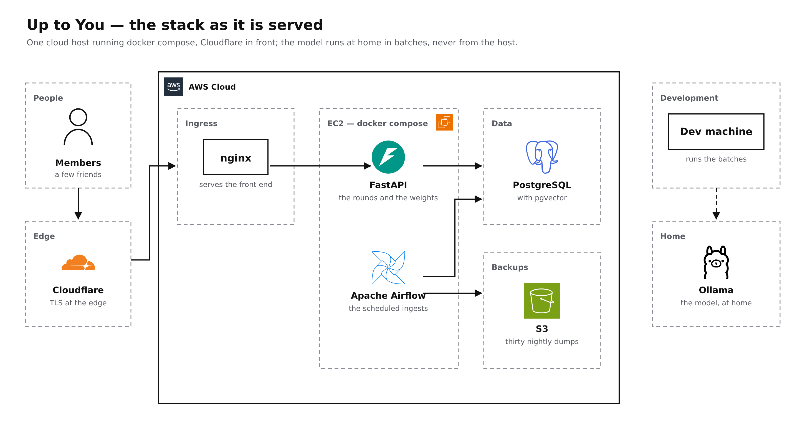
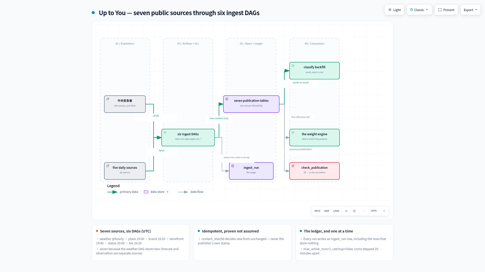
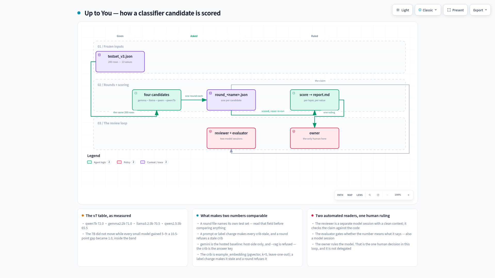

# Up to you

[English](README.md) | [繁體中文](README.zh-TW.md)

[](https://react.dev/) [](https://fastapi.tiangolo.com/) [](https://www.postgresql.org/) [](https://github.com/pgvector/pgvector) [](https://airflow.apache.org/) [](https://ollama.com/) [](#data) [](#architecture)

**A group decides one meal together, and a weighted pair of dice does the choosing.**

For a small group who can never agree where to eat — and who would rather see why a place won than
be told to trust a ranking.

**Try it: [uptoyou.jacksong-tw.com](https://uptoyou.jacksong-tw.com)**

### Try this round

```sh
docker compose run --rm migrate                          # the schema, once per version
docker compose up -d --wait                              # the stack
docker compose exec api python -m upto.issue 1 Kevin     # a device token, printed once
```

Open `localhost:8080`, paste the token, propose three places, roll.

| | |
|---|---|
| **The idea** | Five friends, one meal, nobody wants to be the one who chose. The app chooses, and then shows its work. |
| **How it decides** | Weighted dice, not a ranking. Every factor multiplies a place's odds, and the reveal names each factor beside the number it contributed. |
| **Data** | Seven published government sources through six scheduled ingests; 35,965 Taipei places, 25,031 of them carrying a generated category. |
| **Engineering** | Content-addressed ingest with an idempotent ledger, a three-rung name derivation, and a retrieval-augmented classifier scored on a frozen set. |
| **Measured** | Four local models on one frozen set: 72.0 · 71.0 · 70.5 · 65.5. A no-change ingest costs 1.6 s against 15.0 s to store. The whole city classified in 10.5 h. |
| **Why this stack** | One compose file, one database doing both relational and vector work, and no service that cannot run on a small cloud instance. |

*This English page is canonical: where the two languages disagree, this one is right.*

## See it work


Five screens, and each does one thing:

- **Home** — the circle, and tonight's round if one is open.
- **Device** — paste a token once; the browser remembers the circle.
- **這一餐** — the categories to avoid tonight, as a menu with section marks.
- **Round** — propose places, then roll.
- **Reveal** — the dice stop, then the winner's odds are itemised, factor by factor.

## What problem this solves

Five friends want dinner. Everybody has a mild preference and nobody wants to own the decision, so
the group either defaults to the loudest voice or spends twenty minutes not choosing. The usual
software answer is a ranking, which just moves the argument to whether the ranking is right.

This app rolls dice instead — but the dice are weighted, and the weights are visible. Rain over one
district lowers its odds a little. A place the circle went to last week is halved. A category
somebody quietly avoided costs a place a share of its odds proportional to how many people are at
the table, so at five people one objection is a discount rather than a veto.

**Every one of those factors is a stored row, pinned to the reading it was computed from.** The
reveal does not recompute anything for display: it reads the same rows the roll used and names each
one. That is the difference between a result you are asked to trust and a result you can audit —
and it is why the interesting part of this repository is the pipeline that produces the readings,
not the dice.

## Terminology

| Term | What it means here |
|---|---|
| **Circle** | A standing group of people who eat together. |
| **Member** | One person's seat in a circle. No account, no email — a device token. |
| **Round** | One meal being decided. It opens, collects proposals, and closes on a roll. |
| **Proposal** | A place somebody put forward in this round. |
| **Roll** | Two dice, weighted by the round's factors. One roll counts, named before the dice are seen. |
| **Reveal** | The screen after the roll: the winner, and every factor that moved its odds. |
| **Contribution** | One stored factor — what it multiplied by, which contributor produced it, and which reading it came from. |
| **Place** | A restaurant. Either a row from the published reference list, or one a circle added itself. |
| **Publication** | One fetched file, identified by the hash of its bytes. Never overwritten. |
| **Ingest run** | One attempt at one source. Records what happened, including «nothing had changed». |
| **Name ladder** | How a display name is chosen: storefront sign, then brand, then registered name. |
| **Category** | One of thirteen closed values a place can be classified into. |
| **Crib** | The labeled examples retrieved from pgvector and handed to the classifier as worked examples. |

## What changed, measured

Six numbers where a change was made and both sides were measured.

| What | Before | After | Measured on |
|---|---|---|---|
| An ingest day with no new file | 15.0 s | **1.6 s** | the run ledger, 8 days, 7 sources |
| Embedding one name for the crib | 0.481 s | **0.045 s** | 100 names, twice, 09-04 |
| Classifying one name | 12–19 s on the CPU | **1.27 → 0.92 s** on an 8 GB card | one district, 1,318 rows |
| The registry roster ingest's peak memory | 172 MB | **77 MB** | a 2 GB instance, 09-05 |
| The serving stack at rest | 1,131 MiB | **1,009 MiB** | a 2 GB instance, 09-07 |
| A long classification pass | 1.7× slower first-to-last | **level** | 36,014 rows in 10.5 h, 09-03 |

The memory figures were measured on the 2 GB instance they were taken on; the instance has since
been resized. [The long version](docs/decisions.md) has the working for the last four.

## Architecture



*One host, one compose file. Cloudflare terminates TLS at the edge and the origin answers 443 with
its own certificate; the four Airflow services and the API share one PostgreSQL, each connecting as
its own role.*

| Layer | What runs |
|---|---|
| **Front end** | Vite + React 19 + Tailwind 4 + shadcn/ui, built inside the proxy image. No CDN, no runtime fetch; two subset fonts ship with the bundle. |
| **API** | Python, FastAPI, SQLAlchemy 2.0, async end to end, 43 hand-written Alembic migrations. |
| **Database** | PostgreSQL 17. Five login roles, one per boundary: the API, the ingests, the nightly erasure, the backup, and the owner — which only the one-shot migration container ever holds. |
| **Vector** | pgvector, in that same database. |
| **Orchestration** | Apache Airflow 3, LocalExecutor, in the same compose stack. Its metadata is a second database in the same PostgreSQL. |
| **Models** | Ollama on a home box's 8 GB card, reached through a relay. `gemma2:2b` generates, `snowflake-arctic-embed2` retrieves. |
| **Deployment** | One EC2 instance in Tokyo behind Cloudflare in Full (strict). It pulls images from a public registry and builds nothing. |

## Data



*Seven published sources through six ingests; the weather publisher's forecast and observation are
two sources on one fetch. Every fetch is content-addressed and every run is recorded, including the
no-ops.*

| Schedule (UTC) | Taipei | Source |
|---|---|---|
| hourly | hourly | CWA township forecast `F-D0047-061` + station observations `O-A0001-001` |
| `0 19 * * *` | 03:00 | 食藥署 食品業者登錄 — the restaurant reference list |
| `20 19 * * *` | 03:20 | 臺北市食材登錄平台 — company ↔ brand pairs |
| `40 19 * * *` | 03:40 | 臺北市餐飲衛生分級評核 — the sign an inspector saw |
| `0 20 * * *` | 04:00 | 商業登記-餐館業 — which registrations are dead |
| `20 20 * * *` | 04:20 | 財政部 全國營業(稅籍)登記 — tax name + industry code |
| `0 21 * * *` | 05:00 | deletes every per-meal preference row a roll did not pin |
| `40 21 * * *` | 05:40 | deletes unpinned weather readings older than ninety days |
| `20 22 * * *` | 06:20 | `pg_dump` to S3 after both deletions, thirty kept |

The crons are UTC and the quiet hours they aim at are Taipei's — the daily sources fetch between
03:00 and 04:20 Taipei, one download at a time.

**A publication is identified by the hash of its bytes, not by a timestamp.** A stamp can move while
the data stands still, and stand still while the data moves. Where a file carries its own stamp it
is kept beside the hash as a label and the two are compared every run; a disagreement fails the task
deliberately.

**The cheap half gates the expensive half.** The reference ingest fetches a 17 MB zip, hashes the
compressed bytes, and claims the publication with `insert … on conflict do nothing returning id` —
the *database* decides whether the content is new. Only then does anything decompress the 99 MB CSV
inside. The file is monthly and the poll daily, so about 29 runs a month find nothing and must be
silent successes.

**A run that wrote nothing is still a run.** Every attempt writes a row, and «no change» and
«failed» are different recorded outcomes. Inferred from an absence they are indistinguishable, which
is how a broken source looks healthy for a week.

### What is stored

| | |
|---|---|
| **Places** | 35,965 on the serving instance, 25,031 of them with a generated category. |
| **The tax registry** | A 66 MB zip holding one ~320 MB CSV of 1,711,012 rows — every registered business in the country. Only rows whose 統編 already appears in the latest reference publication are stored: **14,521 kept against 19,203 reference numbers, in about 15 seconds.** |
| **Signs and brands** | 1,686 inspector-recorded signs (1,379 joining the current publication); 288 company ↔ brand rows. |
| **Weather** | Hourly forecast and observation readings, kept ninety days unless a roll pinned one. |
| **The crib** | 537 labeled example names per embedder, in pgvector. |

The tax registry publishes what nothing else does — the 營業人名稱 the tax office holds and the
**行業代號 the business registered itself under**, an official category the shop chose rather than
one a model guessed. The four code/name pairs are stored positionally: the first is the primary
trade, and compacting the empty tail would silently promote a secondary one. One warning sits in the
schema — `business_tax_row.address` is the *registered* address, not the storefront (6.2% of matched
rows sit outside 臺北市), and nothing may join on it.

### Names and categories

**A registered name is a legal entity, not a shop.** The reference list knows
安心食品服務股份有限公司; the people deciding where to eat know 摩斯漢堡. So a display name resolves at
read time down a ladder — **storefront sign → brand → registered name.** The sign wins: an inspector
recorded it against the same registry number, so that join needs no name matching at all. The brand
applies only where a company maps to exactly one, because nothing in either source says which brand
a multi-brand company's site is. A 統編 the registry records as dead, and never alive, drops out of
the search typeahead.

| Rung | Rows | Share | Of those, still names a company |
|---|---|---|---|
| sign (site-level) | 1,379 | 3.8% | 3.3% |
| brand (single-brand companies only) | 4,001 | 11.0% | 44.0% |
| registered (what is left) | 31,119 | 85.3% | 33.3% |

**The ladder reaches 14.7% of the city, and 33.3% of all rows still display a string that names a
company rather than a shop.** Where a sign exists the name is right, and a sign exists for one row
in twenty-six — which is the argument for the next source rather than against this one. The
derivation then splits the sign-less rows that would otherwise collide: 9,136 gain a
district-and-road bracket, 3,234 need the house number, and 22,750 are the only sign-less site of
their company and stay bare.

**Categories are thirteen values, closed:** 麵食 · 飯食 · 小吃 · 火鍋 · 燒烤 · 日式 · 西式 · 早餐 ·
咖啡飲料 · 便利商店 · 台菜 · 素食 · 其他. An answer outside the list is **refused, never repaired** —
coercing 拉麵 into 麵食 turns a wrong answer into a plausible one and deletes the only step in the
process that can fail.

Classification runs as a batch against a locally deployed quantized model, off unless a backfill is
running. The model is asked the best name the project holds — the same ladder — and every decided
row records **the prompt version, the model name, and the exact string that was asked.** A
legal-entity verdict is written as a decided absence: provenance present, category null, so re-runs
never re-ask it. Batches commit as they go, so an interrupted seven-hour pass resumes where it
stopped.

**Set up to be measured, not asserted.** `evaluate/testset_v3.json` is a frozen, teacher-labeled set
of **200 names** — labels drafted by a frontier model and cross-checked by a second, so a score
reads «agreement with the teacher», never ground truth — drawn once, deterministically: fixed seed,
stratified by which rung of the ladder supplied the name, floor of 30 per stratum. The draw has
never been re-run; v1 and v2 are the same 200 rows relabelled, kept because scores against them
still stand, and every report names its set and its sha256 so two numbers compare only when both
match.

### The schema

<!-- The drawn overview belongs here: docs/diagrams/schema-at-a-glance.png — four clusters,
     table names only, and the four pins from weight_contribution to the readings. -->

Generated ER diagrams, regenerated from the live schema so they cannot drift from what the database
holds: [reference](docs/diagrams/er-reference.png) · [weather](docs/diagrams/er-weather.png) ·
[product](docs/diagrams/er-product.png) · [ledger](docs/diagrams/er-ledger.png) ·
[everything](docs/diagrams/er-overview.png). `docs/diagrams/build.sh --check` fails when the schema
and the committed diagrams disagree.

## Key technical decisions

Eleven choices, each with what was turned down and the number that decided it.



*The same 200 frozen rows, one round per model, scored and never re-run.*

**1. Classification runs on a local 3B model; the cloud model is a yardstick, not a worker.**
*Chosen:* a quantized 3B generator on the same box as the database, batch-only, off unless a
backfill runs. *Turned down:* a hosted model as the classifier. *The number:* the free hosted tier
allows 500 calls a day, so 3,300 places take seven days; the local model does them in one night —
and the hosted model's score is kept, as the line the local ones are measured against.

**2. Missing knowledge is added as data, not as prompt text or weights.**
*Chosen:* a retrieval crib — labeled example names embedded into pgvector, the five nearest handed
to the model as worked examples. *Turned down:* another prompt revision; fine-tuning. *The number:*
the prompt revision *lost* points on the frozen set (51.5 → 49.5); retrieval on the same set moved
`gemma2:2b` 51.5 → 61.0 and `llama3.2:3b` 37.0 → 58.0, while `qwen2.5:3b` went 51.0 → 48.5 — the
same crib reads as noise to one model, which is why the pairing is measured rather than assumed.

*The current table* — prompt v7, thirteen categories, `testset_v3`, the same crib
(`snowflake-arctic-embed2`, five neighbours), every round on the home box through the same relay the
scheduled pass uses:

| model | licence | pooled accuracy (200 rows) |
|---|---|---|
| `qwen2.5:7b-instruct` | Apache-2.0 | **72.0%** |
| `gemma2:2b` | Gemma terms | 71.0% |
| `llama3.2:3b` | Llama 3.2 community | 70.5% |
| `qwen2.5:3b-instruct` | research licence — evaluation only | 65.5% |

Three models inside two points of each other, one of them three times the cost per row; the
scheduled pass kept `gemma2:2b`. The hosted yardstick read 60.5% on the first set and has not been
re-run on the third, so the two are not compared in one sentence.

**3. Vector search is a Postgres extension, not a second service.**
*Chosen:* `pgvector` on the database already in the stack. *Turned down:* a dedicated vector store
(Pinecone, Milvus, Qdrant). *The number:* the crib is 537 rows across three embedders — thousands at
most — against one more stateful service to run, back up and monitor.

**4. The evaluation set is frozen, stratified, and its authorship is stated.**
*Chosen:* 200 names, fixed seed, stratified over the three name rungs with a floor of 30, labels by a
teacher model with a second model's cross-check, provenance recorded per row. *Turned down:* scoring
against live rows; owner-only labeling. *The number:* the frozen set caught a prompt that read better
and scored worse, which is the only thing a fixed set exists to do; every report carries the set's
sha256 so two scores compare only when it matches.

**5. A shop's name is resolved down a ladder — sign, then brand, then registered name.**
*Chosen:* three sources joined by registry number, precedence fixed, no fuzzy name matching.
*Turned down:* the registered name alone; string similarity across sources. *The number:* 40.2% of
registered names are legal-entity strings that name no shop at all; the sign differs from the
registered name on 93% of the rows that have one; the brand table renames 57% of the companies it
covers; and a trial of an outside geodata source false-joined 46% on address alone and was dropped.

**6. Official industry codes decide only what they can, and that is one row in ten.**
*Chosen:* the tax registry's codes rule where unambiguous, the model takes the rest. *Turned down:*
codes as the classifier; ignoring codes entirely. *The number:* codes settle 10.9% of city rows, and
a coffee chain's 245 branches register under a wholesale code — a code alone would mislabel every
one of them. The join itself is safe (99.78% name agreement once the legal-form suffix is stripped);
the address is not (89.8% differ). [The long version](docs/decisions.md) measures the same question
on the 200 scored rows, where the defensible upside is +4 rows.

**7. Every source is content-addressed and its no-change days are recorded.**
*Chosen:* a publication row per fetched file, a data row per record, and a ledger where a no-change
day writes a heartbeat. *Turned down:* overwrite-in-place; schedules guessed to match each file's
cadence. *The number:* every source is idempotent on identical bytes — every column of every table
compared, through the real command-line entry point, twice — and the no-change path costs 1.6 s
against 15–19 s for a real store.

*Measured on the schedule itself* — 8 days, 332 ledger rows against 361 Airflow task instances,
nothing instrumented and no column added:

| Source | Store p50 | No-change p50 | Ledger rows |
|---|---|---|---|
| CWA township forecast | 2.99 s | 1.85 s | 149 |
| CWA station observation | 3.09 s | 0.31 s (n=1) | 149 |
| FDA 餐飲場所 reference | none yet | 1.88 s | 5 |
| 食材登錄 brands | 0.57 s | 0.96 s | 8 |
| 衛生評核 signs | 0.31 s | 0.43 s | 7 |
| 商業登記 status | 25.03 s | 2.09 s | 7 |
| 營業稅籍 registry | 12.95 s | 3.58 s | 7 |

**The no-change day is 3.6× cheaper than a store on the largest source** and 12× on the registry
roster — the claim-before-parse short-circuit, priced. **Orchestration costs a flat 1.2 s a task**,
the same whether the source takes half a second or twenty-five. **The scheduler is not the
bottleneck:** queue latency is 0.05 s at p50 and 4.2 s at its worst across all 361 tasks. What none
of this answers is the fetch / parse / store split — nothing records it.

**8. The cloud serves; the home box computes; the ledger is the clock.**
*Chosen:* a small EC2 instance runs the API and database; model batches run on a home box and land
through the same ingest ledger. *Turned down:* a resident model on EC2; all-cloud batches. *The
number:* the whole serving stack sits at 1,009 MiB at rest, while the home box's 8 GB card takes a
retrieval-shaped batch at **0.92 s a name** against 12–19 s on the same box's CPU. [The long
version](docs/decisions.md) has the three measurements this went through, including the two that
were of the wrong thing.

**9. Substring search stays a sequential scan; the trigram index was measured and turned down.**
*Chosen:* leave the typeahead's `ILIKE '%q%'` as it is. *Turned down:* `pg_trgm` + GIN on the three
searched columns. *The number:* the index changed the plan for 0 of 31 realistic queries and left
p50 at 311 → 324 ms, because the predicate ORs a base column against two lateral outputs so the
filter cannot reach the index — and because the cluster's deterministic `C` locale makes `pg_trgm`
emit no trigrams for 96.2% of the names. The scan was never the cost: a per-row lateral brand lookup
executed 35,533 times per keystroke is 93% of the query's buffers, and expressing it as one grouped
join is 61× fewer buffers with a provably identical result.

**10. The small instance was too small for its own nightly work, and the fix was measured before it
was chosen.** *Chosen:* stream the one ingest that held its whole file in memory, then shrink Airflow
with four settings and a memory limit that bites. *Turned down:* a bigger instance first; a swap
file, which turns a crash into a twelve-hour crawl. *The number:* 49 MB free under one ingest became
398 MB worst-case after, and the stack went 1,131 → 1,009 MiB at rest. [The long
version](docs/decisions.md) has the week in the order it happened, including the night that blamed
the wrong component.

**11. The live stream sends a heartbeat because the proxy in front of it cuts silence.** *Chosen:* an
SSE comment line every 25 s, invisible to every screen. *Turned down:* an unproxied hostname, which
gives up the shield the domain exists for. *The number:* through Cloudflare, a stream silent for
130 s was **cut** and a real event afterwards delivered nothing; direct to the origin the same
stream stayed open and delivered — same code, same seconds, side by side, twice. A circle that has
said nothing for two minutes is the normal case for this product, so this blocked the launch.

## Observability and reliability

- **The stream's heartbeat is a comment line every 25 s**, because a silence longer than 130 s is
  cut by the proxy in front of it. It carries no timing a member could read.
- **Each API process holds one listening connection to the database** and fans events out from it,
  so more than one instance can serve one circle. If that connection dies the process says so:
  `/health` answers 503 with `stream_listener` and the time it went down, while still serving reads.
  Measured on a real kill: **503 within 0.18 s, back up on a new connection within 1.23 s.**
- **An API process refuses to serve a schema it was not written against.** It reads the migration
  revision at startup and, if the database is behind, ahead, or never migrated, logs both revisions
  and exits — so a deploy fails at the container that is wrong rather than inside a member's request.
- **The model link is retried, and the retry count is printed.** A cold model on that path presents
  as *down* rather than as slow: the first request fails and the retry twelve seconds later answers
  in half a second. A flaky link reads as a number rather than as a slow night.
- **A failed scheduled task sends one message**, carrying the log's path inside the container and
  never a URL. Alerting is off in a fresh clone by design, and a dedicated job exists that fails on
  purpose so the channel itself can be tested.

## Development journey

| Dates | Phase | What changed | The number |
|---|---|---|---|
| 08-11 to 08-17 | Skeleton and the architecture walk | The stack boots from one compose file; the destination, the batch classifier and its stop-loss ladder settled one at a time; first evaluation rounds on a fixed set | prompts v3 → v5 in two days; v5 with retrieval scored **66.0%** on a 200-row set drawn once |
| 08-18 | The surface reversed | The hand-rolled, no-build front end is replaced by Vite + React 19 + Tailwind 4 + shadcn/ui, built inside the proxy image | one night to re-decide; the served bundle still fetches nothing at runtime |
| 08-19 to 08-29 | The engine's factors, and the surface that shows them | Every member rolls and one roll counts, named before the dice are seen; the rain factor made relative to the pool's driest district; «last time we went here» halves a place; the ingredient veto built, measured and withdrawn for want of coverage | rain: gap ÷ 120, floored at 0.5; ingredient coverage 12.4% of places, which is why the kind left the product |
| 08-29 to 08-31 | The surface frozen | The return-choice surface; an eleventh, then twelfth and thirteenth category; the nightly S3 backup with a restore drill | drill: 19.7 MB dumped in 3.7 s, restored in 9.4 s, counts identical |
| 08-30 to 09-02 | The classifier ladder | A 7B model admitted once the comparison ran on the machine the pipeline actually calls; prompts v6 and v7; the test set relabelled twice; the whole city re-decided; the per-model unload that removed a slowdown | four models on one set: 72.0 · 71.0 · 70.5 · 65.5; 36,014 rows in 10.5 h with five level curves; 其他 down 38% |
| 09-04 | The design round | The tonight screen as a menu with section marks, one slim bar on every inner screen; the reveal's chrome receding; connection and rate limits on the proxy; a 25 s heartbeat on the live stream | a stream silent for 130 s: cut through the proxy, open direct; with the heartbeat, open and delivering |
| 09-04 to 09-07 | Launch on EC2 | One small instance in Tokyo boots the public extract and passes one ingest cycle the same day; the box wedged twice on memory; the roster ingest streamed instead of held whole; TLS terminated in the existing nginx with an Origin CA certificate; Cloudflare live in Full (strict) | 49 MB available under one ingest → 398 MB worst case after; the roster 172 → 77 MB; the stack 1,131 → 1,009 MiB at rest; a health check that cost 7.4 s of CPU every 20 s, gone |
| 09-08 | Images from a registry | Seven image names collapsed to three; images built here and pushed to a public registry tagged with the extract's commit; the box pulls that tag and builds nothing | pull 9 s; memory 479 → 664 MB during the deploy, never dipping |
| 09-11 | More than one instance | The event bus moved into the database so two API processes can serve one circle; the schema step left the boot so instances cannot race one migration; each process's listening connection supervised and reported | a listener killed from the database side: 503 in 0.18 s, reconnected in 1.23 s |

## Future work

- **素食 stops being a category and becomes an attribute** a place carries (素食麵館 = 麵食 + 有素),
  because «I cannot eat here» is a requirement on the table and not a discount. The set returns to
  twelve.
- **More than one instance behind a load balancer**, now that the event bus is in the database and
  the schema step is a deploy step.
- **MLflow over the evaluation rounds**, replacing the round files' home-built bookkeeping.
- **A 超市 category and prompt v8** — the test set has to be re-cut first, or the new score is not
  comparable to the current one.
- **Text-to-speech and speech-to-text rounds** for an introduction recording, scored the same way the
  classifier was: a fixed set, a licence check first, and a number per candidate.

## Quick start

```sh
cp .env.example .env                # names only — the comments state the shape of every value
docker compose run --rm migrate     # the schema, once per version
docker compose up -d --wait         # the stack
curl -s localhost:8080/health
#   {"status":"ok","database":"reachable","instance":"…","stream_listener":"up"}
```

**Two commands rather than one**, because the schema step left the stack's boot so that several
instances cannot race it. It is idempotent — run it on a current database and it does nothing.

- **`localhost:8080`** — the app (`UPTO_HTTP_PORT`); the API and the database are reachable only over
  the compose network. `UPTO_HTTPS_PORT` defaults to 8443 and serves nothing until a `tls/` snippet
  exists, so a fresh clone needs no privileged port and no certificate.
- **`localhost:8081`** — the Airflow UI (`AIRFLOW_HTTP_PORT`), user `admin`.
- The weather ingest needs a free CWA Open Data key (opendata.cwa.gov.tw), read once at init into a
  Fernet-encrypted Airflow Connection — never from the environment, never into XCom or a rendered
  template field. The five open-data files need no credential. New scheduled jobs arrive **paused**
  (`airflow dags unpause <dag_id>`).

Run an ingest by hand — `0` stored or no change, `1` the source failed, `2` the version signals
disagree — or bring the model up for a backfill:

```sh
docker compose exec api python -m upto.ingest.run_places
docker compose exec api python -m upto.ingest.run_business_tax

docker compose --profile model up -d ollama
docker compose exec ollama ollama pull gemma2:2b
docker compose exec ollama ollama pull snowflake-arctic-embed2
docker compose exec api python -m upto.classify.run 63000010 --rag --embed arctic
#   exit 3 = model absent, nothing written
```

**Lineage is served to a model too.** Any reading traces to its publication, its content hash and the
run that wrote it, over MCP on stdio:

```sh
docker compose exec -T api python -m upto.lineage.mcp_server
```

Five tools answer: `run_history`, `run_detail`, `publication_detail`, `forecast_reading_source`,
`observation_reading_source`. A sixth, `explain_place_loss`, is listed **only in order to refuse** —
the trail runs into private per-member choices, and a tool that merely lacks a feature today grows it
the first time somebody finds it useful. A test asserts the refusal.

## Tests

67 test files. Fetch, hash and parse are unit-tested with no network and no database, which is what
keeps the scheduled jobs thin — they supply only *when* and *with which database*:

```sh
python3 api/tests/test_cwa_ingest.py    # and test_fda_ingest, test_fia_ingest, test_dice_table,
python3 api/tests/test_weight_fold.py   # test_classify, test_web_surface, test_evaluate_draw …
```

Integration tests build and drop their own database, in the test-only service that holds the owner's
credential — never in `api`, which connects as a role that cannot `create database`. Every source is
proven idempotent through its real command-line entry point twice, every column compared:

```sh
docker compose run --rm tests python /srv/tests/test_place_ingest_integration.py
docker compose run --rm tests python /srv/tests/test_business_tax_integration.py
```

Every commit passes six local gates in a pre-commit hook. Five need only the standard library, so a
clone needs no toolchain to commit: a secret scan, the `app/` boundary, the font subset against every
member-readable string, the server's own copy drawable in the shipped fonts, and the hazard
register's numbering. The sixth reads every staged Python file with `ruff` and refuses syntax errors
and real faults — undefined names, unused imports, a `.format` whose arguments go nowhere — and
nothing about formatting.

## Privacy

**Authorship dies at the close, in the database.** Closing a round fires a trigger that nulls
`proposal.member_id` for that round, in the transaction that makes the result durable. A trigger
rather than application code, because a manual close over SQL, a fix-up script or a second code path
would each leave authorship behind and none would error.

Nothing on the live stream carries a member, and nothing on it carries a timing a member could read:
a preference write returns 204 and emits no event, because at five people the moment of an event is
one guess away from a name. Preferences are per meal unless kept, erased nightly by a job whose role
can read and delete that table and nothing else; weather readings older than ninety days go the same
way unless a roll pinned them.

## Scope

Taipei only — twelve districts, one city's open data, addresses normalised at the ingest boundary
because the same government file spells the city two ways. Every source is used inside its licence,
and a source whose licence is non-commercial or uncertain is not used at all; there are no ratings,
no reviews and no scraped pages anywhere in the pipeline. Sized for one small group: live room state
per process, five friends rather than five thousand. A portfolio project, developed in a private
repository and extracted here after every merge, so the commit messages carry the reasoning behind
each change.
