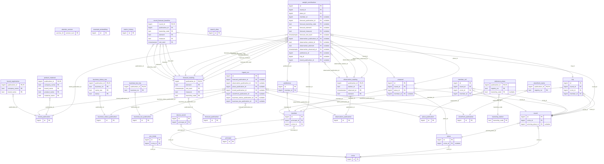

-->

# Up to you（由你決定）

[English](README.md) | [繁體中文](README.zh-TW.md)

[](https://react.dev/) [](https://fastapi.tiangolo.com/) [](https://www.postgresql.org/) [](https://github.com/pgvector/pgvector) [](https://airflow.apache.org/) [](https://ollama.com/) [](#資料管線) [](#部署)

**一群人一起決定一餐，由一對加了權重的骰子公平地選出來。** 每一個推動過店家機率的因素都是一列存下來
的資料，並釘住它是從哪一筆讀數來的，所以結果是一個可以查帳的決定，而不是一個憑空出現的數字。

**Demo：** `https://uptoyou.jacksong-tw.com` —— 東京一台小的 EC2，放在 Cloudflare 後面，跑的就是這裡 `docker compose up` 跑的那一套。本機：下面三行指令。

### 三分鐘可以先試試的兩件事

```sh
docker compose up -d --wait                                  # 整個 stack，一行指令
docker compose exec api python -m upto.issue 1 Kevin         # 一組裝置 token，只印一次
#   → 打開 localhost:8080，貼上 token 和 circle id，提一家店，擲骰
docker compose exec db sh -c 'psql -U "$POSTGRES_USER" -d "$POSTGRES_DB" -c "select source, outcome, count(*), max(finished_at) from ingest_run group by 1, 2 order by 1, 2"'
```

第一件把產品從頭走到尾。第二件讀執行帳本：逐個來源，有幾次執行存了東西、幾次沒有新資料、幾次失敗，
以及最後一次是什麼時候結束的。一個安靜下來的來源會顯示成一個過期的 `max`，而不是一個空白。

### 專案速覽

| | |
|---|---|
| **核心想法** | 五個朋友、一餐飯，沒有人想當那個做決定的人。這個 app 來決定，然後把它的計算過程攤開。 |
| **決策方式** | 加權骰子，不是排名。每個因素都乘上機率，被避開的類型乘以零，而揭曉面板會把每個因素連同它貢獻的數字一起列出來。 |
| **資料規模** | 7 個發佈來源、6 個 ingest DAG（排程上共九個）。**線上主機上**：35,965 家臺北餐飲場所，其中 25,031 家帶有模型產生的分類。**這條管線的歷史比這台主機長**，所以發佈數按主機分開列出並標註起算日：開發資料庫自 2026-08-11 起累積 **五個名稱來源的 30 次發佈**（場所來源是那天開始的；另外四個是 2026-08-14，D77、D78、D81、D85 落地那天），自 2026-08-11 起累積 **每小時天氣的 837 次發佈**；2026-09-04 才建立的線上主機則是 5 次與 69 次。發佈紀錄依設計永久保留——它就是新鮮度探針讀的那本帳——所以天氣那個數字是累計值，不是規模。 |
| **技術重點** | 以內容定址的 ingest 加一本幂等的帳本；被丟掉的表可以從帳本留下的東西重播出來；三層的名稱推導；一個帶凍結評估集的 RAG 分類器。 |
| **量測成果** | 儲存要 15.0 秒、沒有變化的日子 1.6 秒，所以那個短路是被標上價的。四個本地模型在同一個凍結測試集上：72.0 · 71.0 · 70.5 · 65.5（v7，2026-08-30）；託管量尺在第一版集合上是 60.5。全市已經分類完（36,014 列，2026-09-03）。那台 2 GB 的機器跑完每晚的工作還剩 398 MB，而那一週是從 49 開始的。 |
| **技術選用** | 一個 compose 檔、一個資料庫同時做關聯式和向量的工作，沒有任何一個服務是 2 GB 的機器跑不動的 —— 而它現在就跑在一台上面。 |


*一台主機、一個 `docker compose up`：Cloudflare 在邊緣收 TLS，來源端用自己的憑證回應 443；
四個 Airflow 服務和 API 共用一個 PostgreSQL，各自用各自的角色連線。圖上每個方塊都指向真實
存在的東西——可編輯的原始檔是 `docs/diagrams/architecture.json`。*

### 功能展示

五個畫面：首頁 · 裝置 · 這一餐（今晚不吃的類型，排成一份帶區段記號的菜單）· 這一輪（提店，然後擲骰）·
開獎（骰子停下來，然後贏家的機率被一項一項攤開）。每個內頁一條細橫條，左邊返回、右邊三個連結。這份
檔案刻意不放截圖：上面的 demo 就是目前的 build，而一張畫面的截圖從拍下來的隔天起就是舊的。

*模型跑在家裡那台機器的 compose profile 後面：`gemma2:2b` 負責生成，`snowflake-arctic-embed2` 負責檢索。
前端是 Vite + React 19 + Tailwind 4 + shadcn/ui，在 proxy image 裡用 `npm ci && npm run build` 建出來；
出貨的 bundle 在執行期間不抓任何東西。*

*本頁是 [README.md](README.md) 的繁體中文版。**英文版為準**：兩邊若有出入，以英文版為正確。*

一個自架的小工具，給一小群人決定今天去哪裡吃。開一輪、提出店家、擲兩顆骰子 —— 然後在揭曉面板上，
讀到這個機率究竟是怎麼變成這樣的。每一個推動過店家權重的因素都存成自己的一列，並釘住它是從哪一筆
讀數算出來的，所以結果是一個可以查帳的決定，而不是一個憑空出現的數字。

它背後才是這個 repository 真正的內容：六個排程來源，以內容定址（content-addressed）所以沒變的檔案
不花任何成本；一本執行帳本，其中「今天沒變」是一次被記錄下來的心跳；以及從任何一筆讀數回溯到寫入它
的那次執行的來源鏈。

## 技術組成

- **API** — Python、FastAPI、SQLAlchemy 2.0，全程 async，42 個手寫的 Alembic migration
- **資料庫** — PostgreSQL 17 加 pgvector 擴充；Airflow 的中介資料是同一個實例裡的第二個資料庫。五個登入角色，一條界線一個：API、ingest、每晚的抹除、備份，以及只有一次性的 migration 容器才拿得到的 owner
- **排程器** — Apache Airflow 3、LocalExecutor、同一個 compose stack —— 一次只跑一個任務、log 伺服器關掉、健康檢查每兩分鐘一次（見決定 10）
- **模型** — Ollama 跑在家裡那台機器的 8 GB 顯示卡上，經由一個中繼連過去：四個生成模型互相比較
  （`gemma2:2b`、`llama3.2:3b`、`qwen2.5:7b-instruct`，以及只用來評估的 `qwen2.5:3b-instruct` ——
  它的授權是非商用），以及三個給檢索小抄用的嵌入模型（`bge-m3`、`qwen3-embedding:0.6b`、
  `snowflake-arctic-embed2`）。排程上跑的那一對是 `gemma2:2b` × `snowflake-arctic-embed2`
- **前端** — Vite + React 19 + Tailwind 4 + shadcn/ui，在 proxy image 裡建出來；nginx 提供 bundle，並用 Cloudflare Origin CA 憑證收 TLS。沒有 CDN、執行期間不抓任何東西；兩個子集字型跟著 bundle 出貨，一個 pre-commit gate 證明它們涵蓋成員讀得到的每一個字串。

## 資料管線


*七個公開來源、六條 DAG；氣象署的預報和觀測是一次抓取、兩個來源。每次抓取都以內容定址，
每次執行都留紀錄，包括什麼都沒做的那些。*

| DAG | 排程（UTC） | 台北時間 | 來源 |
|---|---|---|---|
| `upto_weather_ingest` | 每小時 | 每小時 | 中央氣象署鄉鎮預報 `F-D0047-061` + 測站觀測 `O-A0001-001` |
| `upto_place_reference_ingest` | `0 19 * * *` | 隔日 03:00 | 食藥署 食品業者登錄 —— 餐飲店家的參考名單 |
| `upto_brand_ingest` | `20 19 * * *` | 隔日 03:20 | 臺北市食材登錄平台 —— 公司 ↔ 品牌對應 |
| `upto_storefront_ingest` | `40 19 * * *` | 隔日 03:40 | 臺北市餐飲衛生分級評核 —— 稽查員看到的招牌 |
| `upto_business_status_ingest` | `0 20 * * *` | 隔日 04:00 | 商業登記-餐館業 —— 哪些登記已經歇業 |
| `upto_business_tax_ingest` | `20 20 * * *` | 隔日 04:20 | 財政部 全國營業(稅籍)登記 —— 稅籍名稱 + 行業代號 |
| `upto_preference_erasure` | `0 21 * * *` | 隔日 05:00 | 刪掉每一筆沒被擲骰釘住的「這一餐」偏好 |
| `upto_weather_retention` | `40 21 * * *` | 隔日 05:40 | 刪掉超過九十天、沒被釘住的天氣讀數 |
| `upto_db_backup` | `20 22 * * *` | 隔日 06:20 | 兩個刪除工作之後 `pg_dump` 到 S3，留三十份 |

**cron 全部是 UTC，而它們瞄準的安靜時段是台北的。** 這裡 Airflow 的 `core.default_timezone` 是
`utc`，所以上面兩欄是同一個時刻用兩個鐘看 —— 每日來源在台北時間 03:00 到 04:20 之間抓，一次只下載
一個。

**一次發佈是用它的位元組雜湊來識別的，不是用時間戳。** 時間戳可能在資料沒動的時候動，也可能在資料
動了的時候不動。內容雜湊才是鍵；檔案自己的時間戳被放在旁邊當標籤，而兩者都存在的時候每次執行都會
比對 —— 不一致就以 exit 2 收場，刻意讓這個任務失敗。

**便宜的那半用來擋住昂貴的那半。** 參考名單的 ingest 抓一個 17 MB 的 zip、對壓縮後的位元組取雜湊，
然後用 `insert … on conflict do nothing returning id` 去登記這次發佈 —— 由**資料庫**決定內容是不是
新的。只有在那之後，才會有人去解壓縮裡面那個 99 MB 的 CSV（827,784 列，其中留下 **36,499** 列臺北市
餐飲）。檔案是月更的而輪詢是每日的，所以一個月大約有 29 次執行什麼都找不到，而那些必須是安靜的成功。

**什麼都沒寫的執行仍然是一次執行。** 每一次嘗試都寫一列 `ingest_run`，而 `no_change` 和 `failed` 是
兩個不同的、被記錄下來的結果 —— 如果從「什麼都沒有」去推論，這兩者無法分辨，而那正是一個壞掉的來源
可以健康地看起來一整個星期的方式。

**來源鏈也提供給模型讀。** 任何一筆讀數都可以追到它的發佈、它的內容雜湊、以及寫入它的那次執行，
走 MCP over stdio：

```sh
docker compose exec -T api python -m upto.lineage.mcp_server
```

五個工具負責回答：`run_history`、`run_detail`、`publication_detail`、`forecast_reading_source`、
`observation_reading_source`。第六個 `explain_place_loss` 被列出來**只是為了拒絕** —— 誠實的軌跡會
一路走進私人的、每個成員自己的否決票，而一個只是「今天還沒有這個功能」的工具，會在第一次有人覺得它
好用的時候長出這個功能。有一個測試斷言這個拒絕。

### 第六個來源，已落地

稅籍是這裡最寬的檔案：一個 66 MB 的 zip，裡面一個約 320 MB 的 CSV，**1,711,012 列 —— 全國每一家
登記的營業人。** 只有統編已經出現在最新一次參考發佈裡的列會被存下來：**對上 19,203 個參考統編，留下
14,521 列，大約 15 秒。** 其餘約 169 萬列從來沒有被寫入 —— 這是一個儲存上的決定，不是最佳化：兩百
公里外一家五金行的稅籍資料，回答不了這個 app 問的任何問題。

它發佈了別的來源沒有的東西 —— 稅捐機關持有的「營業人名稱」，以及**這家店自己登記的行業代號**，一個
官方的分類，是店家自己選的而不是模型猜的。四組代號／名稱是按位置存的：第一組是主要營業項目，而把
空白的尾巴壓掉會靜靜地把次要項目升成主要的。現在存了，還沒有任何東西讀它。schema 裡有一句警告：
`business_tax_row.address` 是**登記**地址，不是店面地址 —— 對上的列裡有 6.2% 落在臺北市之外 ——
所以任何東西都不可以用它做 join。

## 名稱與分類

**登記名稱是一個法人，不是一家店。** 參考名單知道的是安心食品服務股份有限公司；要決定去哪裡吃的人
知道的是摩斯漢堡。所以顯示名稱在讀取的時候沿著一個階梯解析出來 —— **店面招牌 → 品牌 → 登記名稱。**
招牌優先：稽查員是對著同一個登錄字號記下它的，所以那個 join 完全不需要比對名稱（1,686 列，其中
1,379 列對上目前的發佈）。品牌只在一家公司剛好只對到一個品牌時適用（266 家裡有 188 家對上；一家有
多個品牌的公司保留它的登記名稱，因為兩個來源都沒有說這個地點是哪一個品牌）。一個被登記機關記為
歇業、而且從來沒有記為營業中的統編，會從搜尋建議中消失，其他地方的名稱不受影響。

**分類是十三個值，封閉的：** 麵食 · 飯食 · 小吃 · 火鍋 · 燒烤 · 日式 · 西式 · 早餐 · 咖啡飲料 ·
便利商店 · 台菜 · 素食 · 其他（2026-08-30 之前是十個；第十一個來自一個量出來的損失 —— 便利商店是凍結
測試集上最大的單一失誤 —— 最後兩個來自看了一眼「其他」裡藏了什麼）。清單以外的答案會被**拒絕，而不是
被修好** —— 把「拉麵」強行歸成「麵食」，是把一個錯的答案變成一個看起來合理的答案，並且刪掉了整個流程
裡唯一可能失敗的那一步。下一個變動已經裁定：素食不再是一個類別，而是店家身上的一個屬性
（素食麵館 = 麵食 + 有素），因為「我不能吃這裡」是對整桌的要求，不是一個折扣，而類別回到十二個。

分類是以批次的方式跑在一個本地部署的量化 3B 模型上，除非正在回填否則是關著的（尖峰大約 2.1 GB；
部署目標有 4 GB）。模型被問的是這個專案手上最好的名稱 —— 同一個階梯 —— 而每一列做出決定的資料都
記下**提示詞版本、模型名稱，以及被問的那個確切字串**。判定為法人的結果會被寫成一個「已決定的缺席」：
出處在、分類為 null，所以重跑永遠不會再問一次。批次邊做邊 commit，所以一趟被中斷的長時間執行會從
停下的地方繼續。

**做成可以被量測的，而不是被聲稱的。** `evaluate/testset_v3.json` 是一個凍結的、由教師模型標註的
**200 個名稱**的集合 —— 標籤由一個前沿模型草擬、再由第二個模型交叉檢查，所以分數讀作「與教師的一致
程度」，永遠不是絕對正確 —— 只抽過一次，決定性地：固定種子，依名稱來自階梯的哪一層分層，每層至少
30 個，讓招牌層和品牌層這兩個小的層仍然可以評分。這個抽樣從來沒有重跑過；v1 和 v2 是同樣的 200 列在
兩次裁定下重新標註的版本，留著是因為對它們評過的回合都在紀錄上，而每一份報告都寫明它的集合和 sha256，
所以兩個數字只有在兩者都一致時才拿來比較。

## 關鍵技術決定

十一個選擇，每一個都附上被否決的方案，以及決定它的那個數字。每一個的完整論證 —— 以及另外八十幾個較小
的 —— 放在私有的設計紀錄裡；這裡是一個讀這份程式碼的人應該先有的摘要。


*同樣的 200 列凍結資料，每個候選跑一輪，評完就不再重跑；模型由人裁定，兩個自動讀者查核
這個宣稱。*

**1. 分類跑在本地的 3B 模型上；雲端模型是量尺，不是工人。**
*選擇：* 一個量化 3B 生成模型，跟資料庫同一台機器，只做批次，除非在回填否則關著。*否決：* 用託管
模型當分類器。*那個數字：* 免費託管方案一天只允許 500 次呼叫，所以 3,300 家店要七天；本地模型一個
晚上做完 —— 而託管模型的分數被保留下來，當成本地模型被衡量的那條線。

**2. 缺少的知識是以資料的形式補上，不是以提示詞文字或權重。**
*選擇：* 一個檢索小抄 —— 把已標註的範例名稱嵌入 pgvector，把最近的五個當作示範交給模型。*否決：*
再改一版提示詞；微調。*那個數字：* 那一版提示詞（v4）在凍結測試集上**掉分**（gemma 51.5→49.5）；
在同一個集合上，檢索讓 gemma2:2b 從 51.5→61.0、llama3.2:3b 從 37.0→58.0，而 qwen2.5:3b 是
51.0→48.5 —— 同一份小抄對其中一個模型讀起來像雜訊，這正是為什麼這個配對是量出來的而不是假設的。

*目前的表* —— 提示詞 v7、十三個類別、`testset_v3`、同一份小抄（`snowflake-arctic-embed2`，五個
鄰居），每一輪都在家裡那台機器上、經由 DAG 用的同一個中繼跑：

| 模型 | 授權 | 合計正確率（200 列） |
|---|---|---|
| `qwen2.5:7b-instruct` | Apache-2.0 | **72.0%** |
| `gemma2:2b` | Gemma 條款 | 71.0% |
| `llama3.2:3b` | Llama 3.2 community | 70.5% |
| `qwen2.5:3b-instruct` | 研究授權 —— 只用來評估 | 65.5% |

這四個是「原味」的那組，檔名是 `app/evaluation/round_<model>_v7-rag-2026-08-30_arctic.json.report.md`——寫得這麼精確，是因為同一個目錄裡還有其中兩個模型的 `_brandcrib` 版本，那是 2026-09-04 加了一份人工撰寫的品牌小抄之後跑的，分數高 2.5 到 4.0 個百分點；那是另一個實驗，不是同一個實驗跑出更好的成績。

三個模型落在兩個百分點之內，其中一個每列的成本是三倍；排程上的那一趟留用 `gemma2:2b`。託管量尺在
第一版集合上是 60.5%（2026-08-14），沒有在第三版上重跑，所以這兩個數字不放在同一句話裡比。

**3. 向量搜尋是 Postgres 的一個擴充，不是第二個服務。**
*選擇：* 用 stack 裡已經有的資料庫上的 `pgvector`。*否決：* 專用的向量資料庫（Pinecone、Milvus、
Qdrant）。*那個數字：* 小抄是三個嵌入模型合計 537 列 —— 最多也就幾千 —— 而部署目標是一台 2 GB 級的
機器；一個 image tag，對上多一個需要跑、備份和監控的有狀態服務。

**4. 評估集是凍結的、分層的，而且它的標註者被說清楚。**
*選擇：* 200 個名稱、固定種子、依三個名稱層分層且每層至少 30 個，標籤由教師模型標註並經第二個模型
交叉檢查，出處逐列記錄。*否決：* 拿線上資料評分；只由擁有者標註（計畫過，沒有執行 —— 如實記錄）。
*那個數字：* 凍結集抓到了一版讀起來更好、分數更差的提示詞，而那正是一個固定集合存在的唯一目的；
每一份報告都帶著這個集合的 sha256，所以兩個分數只有在雜湊一致時才拿來比較。

**5. 一家店的名稱沿著階梯解析 —— 招牌，然後品牌，然後登記名稱。**
*選擇：* 三個來源用登錄字號 join，優先順序固定，不做模糊比對。*否決：* 只用登記名稱；跨來源做字串
相似度。*那個數字：* 40.2% 的登記名稱是根本沒有指名任何一家店的法人字串；招牌的 join 不需要任何比對
（1,686 列，1,379 列對上目前的發佈）；試過一個外部地理資料來源，只靠地址就有 46% 錯誤 join，已放棄。
跨來源量到的：在有招牌的那些列裡，招牌有 93% 與登記名稱不同，而品牌表把它涵蓋的公司裡 57% 改了名字
—— 這個階梯是在做事，不是裝飾。

*它伸得多遠，在目前整個發佈上量出來* —— 36,499 列，用的是 API 在讀取時用的同一批 join：

| 階 | 列數 | 佔比 | 其中，仍然是一個公司名 |
|---|---|---|---|
| 招牌（D78，地點層級） | 1,379 | 3.8% | 3.3% |
| 品牌（D77，只有單一品牌的公司） | 4,001 | 11.0% | 44.0% |
| 登記（剩下的） | 31,119 | 85.3% | 33.3% |

**這個階梯伸到全市的 14.7%，而所有列裡有 33.3% 顯示出來的字串指的是一家公司而不是一家店。** 這就是
它誠實的現況：有招牌的地方名稱是對的，而每二十六列裡有一列有招牌。這個數字被放在這裡而不是被抹平，
因為它是「需要下一個來源」的論據，而不是反對這個來源的論據 —— 每一階都是先量過才被相信，而這是同一
套紀律的逐階版本。接著 D92 的推導把那些沒有招牌、否則會互相撞名的列拆開：9,136 列加上行政區與路名
的括號，3,234 列還需要門牌號，而 22,750 列是自己公司唯一沒有招牌的地點，保持原樣。一個地點的階在不同
發佈之間是否**穩定**，目前還無法回答 —— 招牌和品牌這兩個來源各只發佈過一次，而一次發佈產生不出可以
比較的間隔。

**6. 官方行業代號只決定它能決定的，而那是十列裡的一列。**
*選擇：* 稅籍代號在沒有歧義的地方作主，其餘交給模型。*否決：* 用代號當分類器；完全不理代號。
*那個數字：* 代號能定案全市 10.9% 的列；某家咖啡連鎖的 245 家分店登記在一個批發代號下，所以光靠
代號會把它們全部貼錯。join 本身是安全的 —— 把法人形式的字尾去掉之後名稱一致度 99.78% —— 而地址不是：
89.8% 不同，13.7% 登記在市外。

*然後在真正被評分的那個集合上再量一次，這比全市的 join 是更嚴格的測試* —— 200 列的凍結評估集。
寫下這段時旁邊引的準確率是 **66.0%**，那是 `gemma2:2b` 加檢索、在 `testset_v1` 上跑提示詞 v5 的結果
（`round_gemma_v5-rag-2026-08-15_arctic.json.report.md`）；同一個模型、同一組設定，現在在 `testset_v3`
上跑 v7 是 **71.0%**，就在上面那張表裡。**下面那些 join 的數字不受影響，而且這不是運氣**：D82 把這
200 列抽過一次就凍結了，v1、v2、v3 之間只差在依裁定重新標註——同樣的列、同樣的順序——所以「200 列裡
有 142 列 join 得到稅籍列」是關於這次抽樣的事實，不是關於評分它的那個提示詞：

- **200 列中有 142 列對上一筆稅籍資料，而其中 75 列是連鎖總部的統編** —— 「不得只靠代號就判定一家
  多點的公司為非餐飲」這條護欄，在這裡是多數情況。
- **一條代號規則的上限是 200 列裡的 +13 列，而那是一個先知上限**；把出現少於四列的代號剔掉，可以
  辯護的上限是 **+4 列，2 個百分點**。最有啟發性的一列是「茶葉批發」：一個批發代號、四個總部統編，
  其中三家是飲料店 —— 在那裡判定非餐飲，四次會錯三次。

所以這個決定誠實的形式是：代號讓管線**更銳利**，而不能取代分類器 —— 跟全市 join 得到的結論相同，
只是現在比較的另一邊有模型自己的分數。哪些代號可以作主、可以決定什麼，是一張必須從登記機關的語意去
論證的對應表，而不是拿 200 列去擬合出來的。

**7. 每個來源都以內容定址，而它沒有變化的日子被記錄下來。**
*選擇：* 每抓到一個檔案就一列發佈（雜湊、去重），每一筆紀錄一列資料，加一本執行帳本，沒變化的日子
寫下一次心跳。*否決：* 原地覆蓋；用猜的排程去配合每個檔案的更新頻率。*那個數字：* 六個每日 DAG，
多數日子什麼都沒存並且把這件事記下來 —— 一個安靜地壞掉的來源和一個安靜的來源因此可以分辨，而那就是
這本帳本存在要解決的「缺席與失敗」問題。是證明過的，不是假設的：每個來源在位元組相同時都是幂等的
（每個表的每一欄都比對過，`tests/test_ingest_idempotency.py`），而沒有變化的那條路徑花 1.6 秒，
對比真正儲存要 15–19 秒。

*在排程本身上量出來* —— 8 天，執行帳本的 332 列，對上 Airflow 的 361 個 task instance，
沒有裝任何儀器、沒有加任何欄位：

| 來源 | 有存 p50 | 沒變化 p50 | 帳本列數 | 任務成功 |
|---|---|---|---|---|
| 氣象署鄉鎮預報 | 2.99 s | 1.85 s | 149 | 162 / 164 |
| 氣象署測站觀測 | 3.09 s | 0.31 s（n=1） | 149 | 164 / 164 |
| 食藥署 餐飲場所 參考名單 | 尚無 | 1.88 s | 5 | 9 / 9 |
| 食材登錄 品牌 | 0.57 s | 0.96 s | 8 | 6 / 6 |
| 衛生評核 招牌 | 0.31 s | 0.43 s | 7 | 6 / 6 |
| 商業登記 狀態 | 25.03 s | 2.09 s | 7 | 6 / 6 |
| 營業稅籍 登記 | 12.95 s | 3.58 s | 7 | 6 / 6 |

排程顯示了三件單獨一次執行看不到的事。**在最大的來源上，沒有變化的日子比真的儲存便宜 3.6 倍**
（3.58 秒對 12.95 秒），在登記名冊上是 12 倍 —— 那就是「先登記、後解析」這個短路的全部價值，被標上
了價。**排程本身的成本是每個任務固定 1.2 秒**（中位數，所有來源，來自 Airflow 記的時長與執行器自己
帳本區間之間的差）：DAG 把 ingest 丟到一個子行程去跑，而這個代價不論來源花半秒還是二十五秒都一樣。
**排程器不是瓶頸** —— 全部 361 個 task instance 的排隊延遲 p50 是 0.05 秒，最差 4.2 秒。這些都回答
不了的是「抓取／解析／儲存」的拆分：沒有任何東西記錄它，而要量它就得加上分階段的計時器和一個放它們
的 schema。

*還有新鮮度的界線，從同一本帳本推導出來，而不是從每個來源自稱的更新頻率* —— 一個來源重新發佈之後，
我們保證會在多久之內注意到（我們這半，由輪詢決定上界），加上它實際上多久重新發佈一次（他們那半，
觀察到的）：

| 來源 | 多久內會發現 | 多久重新發佈一次 | 所以資料最舊是 |
|---|---|---|---|
| 氣象署鄉鎮預報 | 62 分 | 中位 4.3 小時，最差 8.1 小時 | 最多 9.1 小時 |
| 氣象署測站觀測 | 62 分 | 中位 60 分，最差 62 分 | 最多 2.1 小時 |
| 營業稅籍 登記 | 24.0 小時 | 中位 24.0 小時，最差 36.2 小時 | 最多 2.5 天 |
| 食藥署 餐飲場所 參考名單 | 24.0 小時 | 歷史不足：只有 1 次發佈 | 尚不可推導 |
| 食材登錄 品牌 | 24.0 小時 | 歷史不足：只有 1 次發佈 | 尚不可推導 |
| 衛生評核 招牌 | 24.0 小時 | 歷史不足：只有 1 次發佈 | 尚不可推導 |
| 商業登記 狀態 | 24.0 小時 | 歷史不足：只有 1 次發佈 | 尚不可推導 |

**那四列不完整的，是誠實的現況，不是工作的缺口。** 一個只被看到一次的來源，在這段歷史裡就是發佈過
一次，而 *n* 次發佈只產生 *n−1* 個間隔；這些格子會隨著 DAG 繼續跑而自己填滿。它不會做的事，是去借
發佈者自稱的數字 —— 那份名冊自稱是月更的，稅籍摘錄也是按月切的，而這兩件事都不是這條管線觀察到的。
一個抄自網頁的格子，會穿著跟旁邊那些量出來的秒數一樣的格式，卻代表完全不同的東西。**屬於我們的那半
是一個真實的界線**，而且對全部七個來源都成立：這段窗口裡沒有漏掉任何一次輪詢，而最長一段沒有成功
執行的時間，在每小時的來源上是 62 分鐘，在每日的來源上是一天。

**8. 雲端負責服務；家裡那台負責計算；帳本是那個鐘。**
*選擇：* 一台小的 EC2 跑 API 和資料庫；模型批次跑在家裡那台機器上，並且經由同一本 ingest 帳本落地。
*否決：* 在 EC2 上常駐一個模型；全部在雲端跑批次。*那個數字：* 整個提供服務的 stack —— API、資料庫、proxy 和 Airflow —— 在那台 2 GB 的機器上閒置時
是 942 MiB（2026-09-07，決定 10 之後）。家裡那台的 GPU —— 8 GB，同時常駐 2B 生成模型和嵌入模型 ——
跑一個 RAG 形狀的批次
是**一個名字 1.27 秒**，這是在一個行政區的 1,318 列上、用資料庫自己的時間戳量出來的，不是用秒錶。
同樣的批次只用那台機器的 CPU 是一個名字 12–19 秒。

*然後又量了一次，因為第一次量的是錯的東西。* 在一個名字 1.27 秒的時候，GPU 使用率在 0–47% 之間，
功耗只有上限的四分之一：那張卡在等，不是在算。把每一次呼叫分開計時就找到了原因 —— 一次不做任何模型
工作的往返要 48 毫秒，但每一個請求都帶著約 475 毫秒的固定成本，而它**不隨任何東西變化**：不隨輸入
長度、不隨輸出長度、不隨連線。一個名字兩次呼叫，所以 1,270 毫秒裡有約 950 毫秒是按**請求**付的。

**所以解法是發更少的請求，不是更快的請求。** 檢索小抄原本一個名字發一次嵌入呼叫；現在一個 25 列的
commit 批次一次嵌入完，那半從一個名字 0.481 秒降到 0.045 秒 —— **10.8 倍**，在同一組 100 個名字上
量了兩次。*否決：* 同時發出好幾個名字，那在生成那半量到 2.6 倍、並在同時四個請求時就飽和 —— 被否決
是因為一趟執行每 25 列 commit 一次、並從第一個還沒決定的列繼續，而同時 N 個請求既是 N 條可能斷掉的
連線，也是那條乾淨界線的終結。一次斷線已經在 3,324 列的第 400 列殺掉過一趟執行；現在它會重試三次，
而次數會被印出來，讓一條不穩的連線讀起來是一個數字，而不是一個很慢的晚上。

**這趟執行接著越跑越慢，而原因是在那台機器上找到的，不是猜的。** 一趟 2,912 列的執行從一個名字
0.92 秒開始，穩定地惡化到大約 2.0；四個行政區在兩個 build 上彎的方向一樣（頭尾 1.7 倍）。在一個回合
進行中取樣模型伺服器的記憶體，發現它對每一個不同的提示詞都保留一份儲存的狀態，沒有上限 —— 2B 模型
每個請求大約 100 MB —— 直到那台 8 GB 的機器把它殺掉一次。解法是每 N 列把模型卸載一次（N 依模型而定，
`gemma2:2b` 是 25），代價是一次十秒的重新載入，而曲線因此保持水平：全市重跑 36,014 列花了 10.5 小時，
五條曲線都是平的，而原本跟模型結論相反的那個行政區也不再相反。

**這些列住在哪裡，以及兩台主機為什麼對不上。** 分類跑在有 GPU 的那台，既不是線上主機、也不是開發機
自己的 CPU，所以分類好的列是**複製**到線上主機，不是在那裡產生的。而兩台主機各自跑自己的參考資料匯入，
公開檔案本身又會變：2026-09-07 那天，線上主機自己那一版的發佈已經不再收錄當初分類時用的 532 個統編
——它們在這期間歇業或註銷了——那些列於是在那邊被刪掉，因為最新的發佈才是「哪些店還開著」的真相，
而來源不再列出的店，產品也無法顯示。所以**線上主機有 35,965 家、開發資料庫有 36,497 家參考來源的店（兩邊同一個單位），
而這跟那份發佈本身的 36,499 列是不同的東西——其中兩列共用同一個統編——這個差距是來源在動，不是哪裡壞了**。它會在下一次全市重跑、或分類結果改成每晚自動送過去時消失。

**9. 子字串搜尋維持循序掃描；三連字元索引量過之後被否決。**
*選擇：* 讓搜尋建議的 `ILIKE '%q%'` 保持原樣。*否決：* 在三個被搜尋的欄位上加 `pg_trgm` + GIN；
改寫成相似度運算子。*那個數字：* 這個索引在 31 個實際查詢裡改變了 0 個查詢計畫，p50 從 311 變成
324 毫秒，因為那個條件是把一個基礎欄位和兩個 lateral 的輸出用 OR 串起來，所以過濾條件到不了索引 ——
也因為這個叢集決定性的 `C` locale 讓 `pg_trgm` 對 96.2% 的名稱產生不出任何三連字元。改寫成相似度
運算子的版本對每一個中文查詢都回傳零列，已被拒絕。掃描從來不是成本所在：參考表只佔這個查詢
buffer 的約 1%；一個每次按鍵執行 35,533 次的逐列 lateral 品牌查詢佔 93%，而把它寫成一個 grouped
join 是少 61 倍的 buffer，並且結果可證明相同 —— 那是另一個還沒做的修改。

**10. 那台 2 GB 的機器跑不動它自己每晚的工作，而解法是先量過才選的。** *選擇：* 把唯一一個把整份檔案
抓在記憶體裡的 ingest 改成串流，然後用四個設定和一個真的會擋的記憶體上限把 Airflow 縮小。*否決：*
先換大機器（裁定了，然後被帳號方案拒絕）；加 swap（把當機變成十二小時的爬行）；沒有表就調參數。
*那些數字，照它們到來的順序，時間是 2026-09-04 到 09-07：* 第一晚，八個 DAG 在一個迴圈裡一起解除暫停，機器卡死，而雲端的每一個
健康檢查都是綠的；一次一個走過去，登記名冊那一個把可用記憶體壓到 **49 MB**，線是 150 MB；接著發現名冊
的 ingest 把 209,472 個列物件抓在手上直到寫完 —— 改成每 5,000 列串流寫入，尖峰從 **172 降到 77 MB**，
存進去的列一模一樣；然後第二晚顯示真正的成本是 Airflow 本身，閒著就吃約 1.35 GB，而同一分鐘的兩個
任務讓機器爬了十二小時，一行 OOM 都沒有。在一套臨時 stack 上量：一次只跑一個任務、log 伺服器關掉、
一個解析程序、健康檢查每 120 秒一次，閒置時整個 stack 從 **1,131 降到 1,009 MiB** —— 而機器那個
神秘的 80% 閒置 CPU 就是健康檢查本身，兩個服務各自每 20 秒做一次 **7.4 秒**的 CLI 冷啟動。之後在那台
機器上，每一個排程的工作一個接一個跑，最差的讀數還剩 **398 MB**，核心的擊殺計數器是零。機器維持小的。

**11. 即時串流送心跳，因為前面的代理會切斷沉默。** *選擇：* 每 25 秒一行 SSE 註解，任何畫面都看不到。
*否決：* 一個不經代理的主機名稱（放棄了買網域就是為了它的那層盾）；斷了再連、希望沒事。*那個數字：*
經過 Cloudflare，一條安靜了 130 秒的串流被**切斷**，之後的真實事件什麼都送不到；直連原站，同一條串流
保持開啟並送達 —— 同樣的程式碼、同樣的秒數，並排，兩次。加上心跳之後，同一個探針走同一個主機名稱讀到
的是開啟並且送達。一個兩分鐘沒人說話的圈子對這個產品是常態，所以這是上線的阻擋項，不是打磨項；那行
註解不帶任何成員讀得到的時間訊號（見隱私）。

## 這個專案是怎麼做出來的

程式碼只是這個 repository 的三分之一；另外兩份是每個決定怎麼下的紀錄，和檢查它的儀器。八個習慣，各附一個實例。

- **一次一個決定，帶建議、代價、被拒絕的分支，和日期。** 每個裁定只存在一處，在私有的設計日誌裡從 D1 開始編號；上面的十一個決定是它的摘要。實例：上線畫面的結構在九月初一個「最終」版本之後被重裁了三次，所以現在畫面結構一律先用線框圖和功能清單裁一次，才動工（2026-09-04）。
- **先量，再裁。** 紀錄裡的數字贏過形容詞，而且先檢查儀器，再怪產品。實例：Airflow 記憶體那一週（2026-09-04 到 09-07）：上線機器當機兩次，第一次的判讀怪 ingest，量出來的原因是排程器自己的體積，加上一個每 20 秒把 CLI 冷啟動一次的健康檢查；同一天九個紅燈裡七個是測試工具在量自己，所以每個測試工具現在都寫明「產品沒事時什麼會讓它報缺陷」。
- **Gate 在本機，不在 CI。** 六個 pre-commit gate 在 commit 的機器上跑，clone 不需要任何工具鏈；CI 重跑測試，但不做決定。實例：字型子集 gate 會拒絕一個文案需要出貨字型沒有的字的 commit（2026-08-28）；這個缺口在任何有系統 CJK 備用字型的機器上都看不見，所以 gate 是唯一看得到它的地方。
- **寫的人不評自己的作品。** 出貨的畫面由一個看不到建構者推理的讀者從頁面和線路上把關；每個後端 diff 在被命名為候選之前，都先對照它引用的裁定和它說的測試被讀過一次（2026-09-07 起）；視覺決定從渲染出來的頁面裁，不從文字裁。實例：reviewer 上工第一天，在一個所有測試和開機檢查都通過的候選裡找到兩個問題。
- **授權乾淨，否則不用。** 每個資料來源和模型碰之前，授權先進紀錄。實例：`qwen2.5:3b-instruct` 是研究授權，所以可以在評測回合被問，永遠不能當 pipeline 的模型；同一條規則在 2026-09-07 篩了語音合成的候選：四個可用、四個拒絕、兩個不確定因此排除。
- **來源勝過推測。** 發布檔以內容位址存放，從不覆寫；每份發布記錄它來自的檔案形狀；每個動過一家店機率的權重，都是一列釘在它算出時所依據的讀數上的資料。實例：一張被刪掉的表可以從帳本留下的東西重放；開獎頁可以說出每個因素來自哪一次執行。
- **產品陳述，從不建議。** 天氣以資訊呈現，從不作為去哪裡的理由；開獎頁逐條列出發生了什麼，不推薦任何事。實例：「下雨讓這家店機率變低」是會員讀得到的一列貢獻；「你應該選不下雨的那家」是這個畫面產生不出來的句子。
- **現成的比較好時，用現成的。** 第一版畫面是手刻的，沒有 build 步驟、沒有框架；2026-08-18 改建在 React 19 + Vite 上，因為手刻對畫面需要的東西來說太慢。同一條規則現在把 MLflow 帶進來（2026-09-11），而不是留著自製的替代品。

## 迭代時間軸

日期是紀錄的日期；最後一欄的數字是決定那一列的數字。

| 日期 | 階段 | 改了什麼 | 那個數字 |
|---|---|---|---|
| 2026-08-11 到 08-17 | 骨架與架構走查 | `docker compose up` 一個指令開起 db、api、proxy（08-11）；目的地、批次分類器和它的停損階梯一次一個裁定（08-13）；固定集合上的第一批評測回合（08-14、08-15） | 兩天內 prompt v3 → v4 → v5；v5 加檢索，在只抽一次的 200 筆集合上打出 **66.0%** |
| 2026-08-18 | 畫面反悔 | 手刻、無 build 的前端換成 Vite + React 19 + Tailwind 4 + shadcn/ui，在 proxy image 內建置；私人偏好畫面同日裁定 | 一晚重裁；出貨的 bundle 執行期仍不抓任何東西 |
| 2026-08-19 到 08-29 | 引擎的因素，和呈現它們的畫面 | 每個成員都擲骰、其中一顆算數、骰子出現前就點名（08-19）；下雨因素改成相對於池子裡最乾的鄉鎮（08-27）；「上次去過」機率減半（08-27）；食材否決建了、量了、因為覆蓋率不足撤了 | 下雨：差距 ÷ 120，下限 0.5；食材覆蓋率 12.4%，這就是那個類型離開產品的原因 |
| 2026-08-29 到 08-31 | 上線候選 1 到 5 | 畫面凍結，以命名的候選重新把關；把選擇權交還使用者的畫面（候選 4）；第十一、再第十二和十三個類別，以及不帶版本的「為什麼」句（候選 5）；每晚備份到 S3 並做還原演練 | 演練：19.7 MB 3.7 秒 dump、9.4 秒還原、筆數一致（08-30） |
| 2026-08-30 到 09-02 | 分類器階梯 | gate 改為跟隨 pipeline 實際呼叫的機器後，7B 候選入場；prompt v6 與 v7；測試集在裁定下重標兩次（v1 → v3）；全市以 v7 重判；每模型卸載一次消除了變慢 | 四個模型同一集合：72.0 · 71.0 · 70.5 · 65.5；36,014 筆 10.5 小時、五條曲線都平；「其他」減 38% |
| 2026-09-04 | 設計回合，候選 6 到 8 | 今晚畫面改成有段落標記的菜單、每個內頁一條細橫條、角花；開獎頁的框線退後 | 一天三個候選；從此結構先從線框圖裁 |
| 2026-09-04 | 候選 9 與 10：前面的 proxy | proxy 上的連線與速率限制；量到 Cloudflare 的閒置切斷（並排、兩次）後，即時串流加上 25 秒心跳 | 一條 130 秒沒動靜的串流：經 proxy 被切、直連保持開啟；有心跳後，開啟且會送達 |
| 2026-09-04 到 09-07 | 上 EC2 | 東京一台 `t3.small` 開起公開抽出版，當天跑完一輪 ingest；機器因記憶體當機兩次；名冊 ingest 改成串流不整份持有（候選 11）；TLS 在現有的 nginx 用 Origin CA 憑證終止（候選 12）；Airflow 縮到 2 GB 機器裝得下（候選 13）；Cloudflare 以 Full (strict) 上線 | 一個 ingest 下剩 49 MB → 之後最差 398 MB；名冊 172 → 77 MB；閒置 1,131 → 1,009 MiB；一個每 20 秒吃 7.4 秒 CPU 的健康檢查，消失 |
| 2026-09-08 | image 來自 registry | 七個 image 名字收成三個；在這裡 build、以抽出版的 commit 為 tag 推到 GHCR；機器就拉那個 tag，不再 build | pull 9 秒；部署中記憶體 479 → 664 MB，從未下降 |
| 2026-09-11 | 候選 14，與工具回合（進行中） | 開獎後重新整理的成員拿到和現場看的人一樣的公平性證據；在既有回合檔之上引入 MLflow；「長成多台」的研究頁（負載平衡器可用，RDS 待一條政策） | 撰寫時已建好、審查中 |

## 部署

**機器自己去拉；沒有東西進得來。** 東京一台 EC2 `t3.small`，對這個 repository 的公開抽出版跑
`docker compose up` —— 同一個 compose 檔、同樣的 image、同樣的 migration。它自己去抓合併進來的東西；
沒有任何 CI 系統握有進入它的路。Cloudflare 以 Full (strict) 模式擋在產品主機名稱前面，nginx 上是
Origin CA 憑證，而安全群組只允許 Cloudflare 公佈的網段連 443。家裡那台 GPU 機器做模型的工作（決定 8）
並且連不到任何東西；分類完的列往外送到那台機器上。**備份：** 每晚用一個唯讀角色 `pg_dump` 到 S3，留
三十份，只在上傳成功之後才清舊的；在 338 MB 的開發資料庫上做的還原演練，倒出 3.7 秒、還原 9.4 秒，
筆數一致；那台機器自己的倒檔是 31.2 MiB、12 秒。上線 runbook 的通過標準是同一天在機器上存成一整個
ingest 週期、記憶體的數字撐住 —— 不是「它開起來了」。

## Gate 與審查

每個 commit 都過六個本地的 gate，放在 pre-commit hook 裡。其中五個只用標準函式庫，所以一個 clone
不需要任何工具鏈就能 commit：秘密掃描、`app/` 的邊界（沒有私有的東西漏進抽出版）、字型子集對每一個
成員讀得到的字串、伺服器自己的文案在出貨的字型裡畫得出來，以及危害登記簿的編號。第六個用 `ruff` 讀每一個
進了暫存區的 Python 檔，擋掉語法錯誤和真正的錯——沒定義的名字、沒用到的 import、參數送不到任何地方的
`.format`——但完全不管排版；沒裝 `ruff` 的機器上，它會說出少了什麼、什麼都不檢查、讓 commit 過去，因為
那是這道 gate 自己的相依套件，不是這個 repo 的。在 gate 之上還有兩個沒有
寫這個改動的讀者：畫面是從提供出去的頁面和線路上判斷的，有自己的測試工具（一個五個 agent 的走查、
一個負載階梯、一個要求「送達」而不只是「socket 開著」的沉默測試）；而每一個後端的 diff 在一個 build
被命名為候選之前，都對著它引用的裁定和它說的測試被讀過一次。這些工具從「量到自己」學到什麼、
為什麼每一個現在都會寫下「如果產品沒問題，什麼會讓它回報缺陷」，在上面的〈這是怎麼做出來的〉。

## 圖



*從線上 schema 重新產生，不是畫出來的，所以它無法跟資料庫實際的樣子脫節。*

同一個系統的四個視角，在 `docs/diagrams/` —— 每個 PNG 旁邊都有一份自足的原始檔，沒有任何一個會發出
外部請求。**畫出來的那三張已在 2026-09-07 依照實際部署的程式碼重畫，圖上每一個方塊都指向真實存在的
東西**：compose 的服務、十一個 DAG 的 id 與排程、七張發佈表、proxy 真正在聽的埠。它們可編輯的原始檔是
旁邊那個 `.json`——`architecture.json`、`etl-flow.json`、`evaluation-flow.json`——`.html` 則是它的
獨立渲染版；ER 那組維持 `.mmd`，從線上 schema 重新產生（`docs/diagrams/build.sh --check` 只回報那一組
的漂移，不碰手畫的三張）：

- **架構** — `architecture.png`：實際提供服務的 compose stack、Cloudflare 後面的那台機器、中繼後面的
  家用機器、每晚倒到 S3 的備份。
- **ETL 管線** — `etl-flow.png`：七個來源、六個 DAG（氣象署的預報和觀測是一次抓取、兩個來源）、它們共用的那一條以內容定址的路徑、執行帳本的
  三種結果，以及讀取時的名稱階梯。
- **AI 評估** — `evaluation-flow.png`：凍結測試集、pgvector 小抄、四個本地候選模型和託管量尺，以及
  一個 build 周圍的兩道人為把關。
- **ER 圖** — `er-overview.png` 是全部 26 個表；好讀的是那四個群組：`er-reference.png` ·
  `er-weather.png` · `er-product.png` · `er-ledger.png`。由 `erdify` 從線上 schema 產生
  （`docs/diagrams/build.sh`）；`build.sh --check` 會在 schema 和已提交的圖不一致時失敗。

## 隱私

**作者身分在收盤時死掉，而且是在資料庫裡。** 關掉一輪會觸發一個 trigger，把那一輪的
`proposal.member_id` 設為 null，就在讓結果變成永久的那個 transaction 裡。用 trigger 而不是應用程式
的程式碼，因為手動用 SQL 收盤、一支修補腳本、或第二條程式路徑，每一種都會把作者身分留下來，而且沒有
一種會報錯。即時串流上不帶任何成員資訊，也不帶任何成員讀得到的時間訊號：寫入一筆偏好回 204、不發
任何事件，因為五個人的時候，一個事件的時間點離一個名字只差一次猜測。偏好只留這一餐，除非按了保留；
每晚由一個只能讀和刪那張表的角色抹掉；超過九十天的天氣讀數也一樣，除非有一次擲骰釘住了它。

## 快速開始

```sh
cp .env.example .env      # 只有名稱 —— 註解說明了每個值的形狀
docker compose up -d --wait
curl -s localhost:8080/health   # {"status":"ok","database":"reachable"}
```

- **`localhost:8080`** —— 這個 app（`UPTO_HTTP_PORT`）；API 和資料庫只能從 compose 網路內部連到。
  `UPTO_HTTPS_PORT` 預設是 8443，在 `tls/` 裡沒有設定片段之前什麼都不提供 —— 一個新的 clone 不需要
  特權 port，也不需要憑證。
- **`localhost:8081`** —— Airflow 介面（`AIRFLOW_HTTP_PORT`），使用者 `admin`。
- 天氣 ingest 需要一組免費的氣象署 Open Data key（opendata.cwa.gov.tw），在 init 時讀進一個
  Fernet 加密的 Airflow Connection —— 永遠不從環境變數讀，也永遠不進 XCom 或被 render 的 template
  欄位。另外五個開放資料檔案不需要憑證。新的 DAG 到達時是**暫停的**（`airflow dags unpause <dag_id>`）。

手動跑一次 ingest —— `0` 有存或沒變化、`1` 來源失敗、`2` 兩個版本訊號不一致 —— 或者把模型叫起來
做回填：

```sh
docker compose exec api python -m upto.ingest.run_places
docker compose exec api python -m upto.ingest.run_business_tax

docker compose --profile model up -d ollama
docker compose exec ollama ollama pull qwen2.5:3b-instruct-q4_K_M
docker compose exec api python -m upto.classify.run 63000010   # exit 3 = 模型不在，什麼都沒寫
```

## 測試

62 個測試檔案。抓取、雜湊和解析都有不需要網路也不需要資料庫的單元測試，那就是
DAG 之所以能保持很薄的原因 —— 它們只提供**什麼時候**跑和**用哪個資料庫**：

```sh
python3 api/tests/test_cwa_ingest.py    # 以及 test_fda_ingest、test_fia_ingest、test_dice_table、
python3 api/tests/test_weight_fold.py   # test_classify、test_web_surface、test_evaluate_draw …
```

整合測試會建立並丟掉它們自己的資料庫，而且跑在只給測試用的服務裡——不是 `api`。`api` 連線用的角色
無法 `create database`。每個來源都經由它真正的 CLI 跑兩次、逐欄比對，證明是幂等的：

```sh
docker compose run --rm tests python /srv/tests/test_place_ingest_integration.py
docker compose run --rm tests python /srv/tests/test_business_tax_integration.py
```

## 範圍

只有臺北市 —— 十二個行政區、一個城市的開放資料，地址在 ingest 的邊界上正規化，因為同一份政府檔案把
市名寫成兩種樣子。每一個來源都在它的授權範圍內使用，而授權是非商用或不確定的來源完全不用；整條管線裡
沒有評分、沒有評論、沒有任何爬下來的網頁。尺寸是給一小群人的：一個 API worker、房間狀態放在記憶體裡、五個朋友而不是五千個。
這是一個作品集專案，在私有 repository 裡開發，每次併入 main 之後抽取到這裡，所以 commit 訊息帶著每
一個改動背後的理由。
