# 由你決定 Up to you

[English](README.md) | [繁體中文](README.zh-TW.md)

**朋友吵不出要吃什麼的時候，讓加權骰子幫大家做決定，沒有人需要當壞人。**

你說「隨便」，真的是隨便嗎？還是只是不想當那個選錯的人？

**直接試用：[uptoyou.jacksong-tw.com](https://uptoyou.jacksong-tw.com)**

## 為什麼做這個

朋友問要吃什麼，大家都回「都可以」。二十分鐘過去，還是沒人決定，不然就是最大聲的那個人說了算。

一群人決定去哪吃飯，常卡在三個地方：

1. **沒有人想負責。** 挑的人要承擔那一句「早知道就不要吃這家」，所以大家都說「都可以」，事情就卡住。
2. **常見的解法只是換個地方吵。** 排行榜讓大家改吵排行榜準不準，最後還是要有人挑；投票用多數決，少數的那個人每次都吃虧。
3. **大家知道的事實被丟掉。** 某一區在下雨、上週才吃過某家、有人今天整類食物都不能吃。擲銅板全部不管；吵一吵，就變成誰大聲誰說了算。

「由你決定」把選擇交給一次沒有人能控制的抽籤，再讓這些事實照規則影響每家店被抽中的機會：

- 每家被提名的店都有機會被抽中；下雨、上次去過、有人不想吃，會照寫好的規則讓它的機會變小，不是看誰比較大聲；
- 抽籤在大家提店之前就已經固定，沒有人能動手腳；
- 你這次不想吃的類別只有你自己知道：它會影響機會，但不會讓別人看到；
- 不說哪家好吃，只呈現關於這家店的事實。

## 骰子怎麼決定

兩顆骰子有 36 種結果，每一種對應籤詩櫃的一格。每家被提名的店分到其中幾種，大家知道的事實會改變它分到多少：

| 因素 | 對機會的影響 | 原因 |
|---|---|---|
| 那一區在下雨 | 降低，跟這次候選裡最乾的那一區比 | 下雨天走路是真的麻煩 |
| 這個圈子上次去過 | 減半 | 換換口味，但不排除 |
| 有人避開這個類別 | 降低 1/N，N 是同桌人數 | 五個人裡一個人反對，比兩個人裡一個人反對輕 |
| 都沒有 | 不變 | 每家店都從 1 開始 |

這是**加權骰子，不是排行榜**。有人避開的類別是**打折，不是否決**：五個人同桌時只少五分之一，還是有機會中。這些係數是寫死的規則（×0.5、1/N、×0.8）：沒有真實的團體選擇紀錄可以拿來訓練模型，而寫明的規則可以被檢查。

## 怎麼用

> **30 秒試玩。** 打開網站，建立一個圈子（一起決定一餐的一群人）。複製邀請連結，用無痕視窗打開，這個視窗就當作第二位朋友。
> 兩邊各提一家店，按「提交」；大家都提交了，就開獎。
>
> **試用版的範圍：** 只有臺北的餐廳，跑在一台小主機上，同時容納幾組人。不用註冊、不用 email。

1. **打開首頁**：今天的天氣，和「開一個圈子」。

   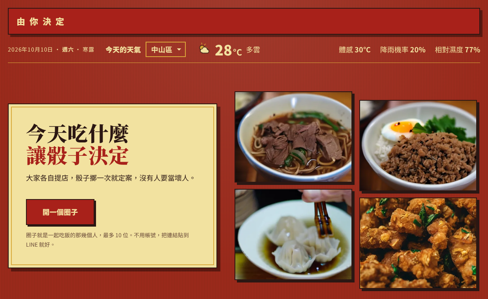

2. **建立圈子**：替這群人和自己取名字。

   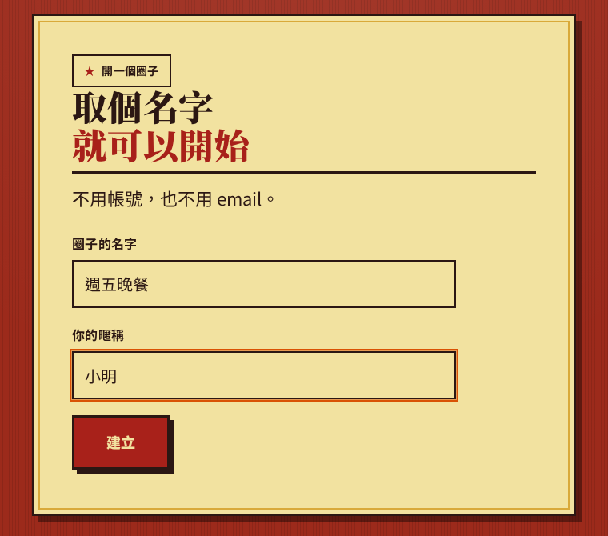

3. **傳邀請連結**（這張圖把連結本身遮起來了；誰點了連結，誰就有座位）。

   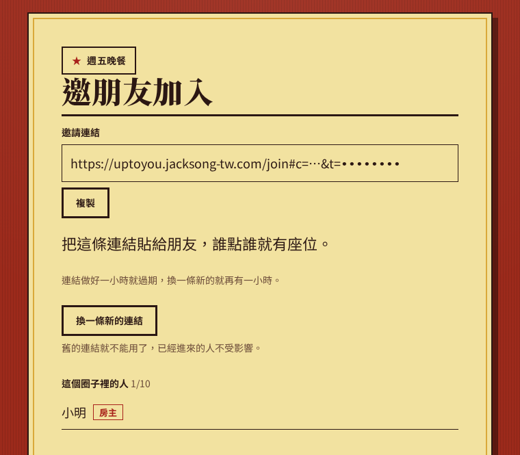

4. **朋友取個暱稱加入。**

   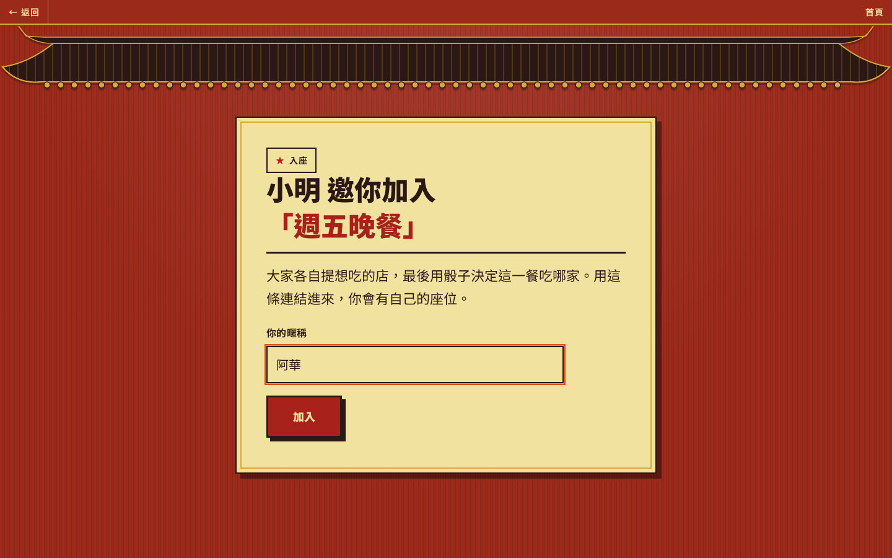

5. **提議店家，勾選這次不想吃的類別**（只有自己知道，不會給別人看）。

   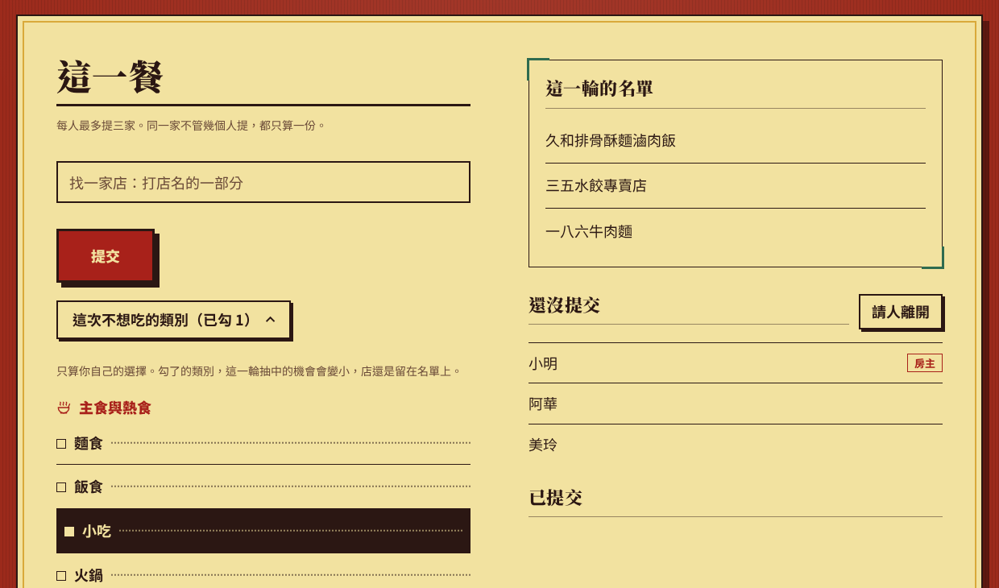

6. **按「提交」**；大家都提交之前，畫面會列出還沒提交和已提交的人。

   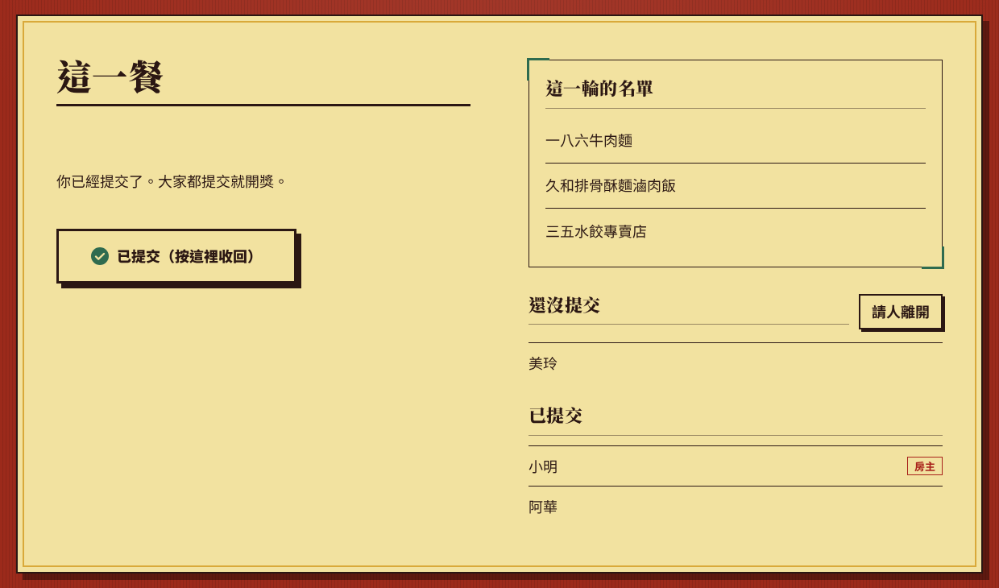

7. **開獎**：每一輪會是骰子或籤筒其中一種，接著亮出抽中的那一格和籤。

   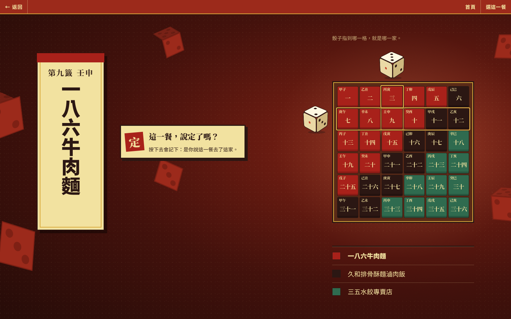

---

**以下是它怎麼做出來的。**

[](https://github.com/JacksonG-TW/Uptoyou/actions/workflows/ci.yml) [](https://react.dev/) [](https://fastapi.tiangolo.com/) [](https://www.postgresql.org/) [](https://github.com/pgvector/pgvector) [](https://airflow.apache.org/) [%20%2B%20arctic--embed2-000000?logo=ollama&logoColor=white)](https://ollama.com/) [](#系統架構)

**接著看：** [資料管線 →](#資料管線) · [分類模型 →](#分類模型與評估) ·
[抽籤與隱私 →](#資料庫裡的抽籤與隱私) · [自己架起來 →](#快速開始)

## 三個數字看成果

| 成果 | 量測內容 |
|---|---|
| **資料管線**：當晚沒有新資料，**15.0 秒 → 1.6 秒** | 七個政府開放資料來源（六個排程，其中氣象排程一次抓兩種資料），每晚更新臺北 35,965 家餐廳。用雜湊值判斷檔案有沒有變，沒變就直接跳過解析。 |
| **AI 分類**：料理類別正確率 **51.5% → 61.0%**（加入檢索） | 家裡的顯示卡跑二十億參數的模型，幫每家店分類，用同一份 200 筆人工標註、固定不變的測試集評分。先檢索五筆相似的已標註店名當範例，正確率就跳上來。之後測試集改成十三個類別、重新標註 19 筆，在新測試集上是 71.0%（測試集不同，兩個數字不互相比較）。另有一個 [MCP 工具](#給-ai-agent-用的工具透過-mcp-查資料血緣)，讓 AI agent 不用寫 SQL 就能查任何數字的來源（哪一份政府檔案、哪一晚的排程）。 |
| **正式上線**：API 與資料庫的即時連線被切斷，`/health` **0.18 秒內回報，1.23 秒重新連上** | 跑在一台 EC2 上，前面接 Cloudflare。排程失敗會傳手機通知；每晚的備份 9.4 秒就能還原到全新的資料庫。 |

## 資料管線

### 七個來源，一張排程表

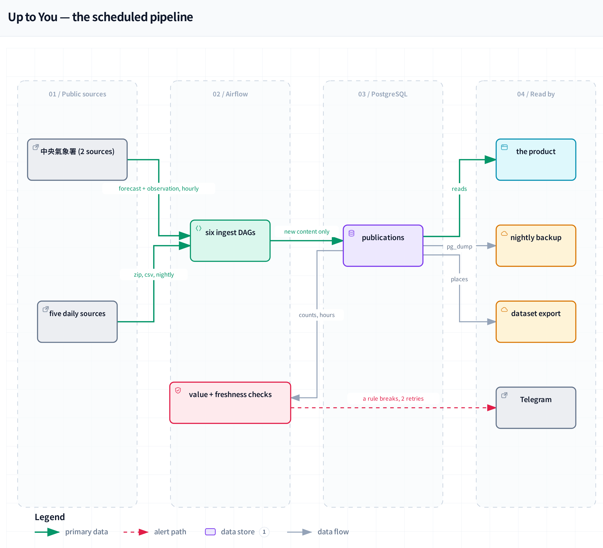

圖表顏色：藍＝公開資料、綠＝天氣、朱紅＝產品、灰＝資料庫與儲存的檔案、紫＝排程管線、黃＝通知與模型。

七個來源分成六個匯入排程：中央氣象署的排程同時抓預報和測站觀測。全部是政府開放資料，都在授權範圍內使用。來源之間用統編、登錄字號這類編號串接，不用店名模糊比對。

| 臺北時間 | 排程 | 內容 |
|---|---|---|
| 每小時 | 中央氣象署 | 鄉鎮預報 `F-D0047-061` + 測站觀測 `O-A0001-001` |
| 03:00 | 食藥署 食品業者登錄 | 餐廳主清單 |
| 03:20 | 臺北市食材登錄平台 | 公司 ↔ 品牌對照 |
| 03:40 | 臺北市餐飲衛生分級評核 | 稽查員看到的招牌名稱 |
| 04:00 | 商業登記-餐館業 | 哪些登記已經歇業 |
| 04:20 | 財政部 全國營業(稅籍)登記 | 稅籍名稱 + 行業代碼 |
| 04:30 | 新鮮度檢查 | 哪個來源停止更新、停了幾小時 |
| 05:00 | 偏好清除 | 刪掉沒被任何一輪用到的單餐偏好 |
| 05:40 | 氣象資料保留 | 刪掉超過九十天、沒被用到的氣象資料 |
| 06:00 | 圈子清理 | 移除已經沒人用的圈子 |
| 06:20 | 備份 | `pg_dump` 到 S3，排在兩個刪除之後，保留最近三十份 |
| 07:00 | 資料集匯出 | 全部店家匯出成 Parquet，放到 S3 |

每天的來源間隔二十分鐘開跑，避免兩個同時搶主機記憶體；刪除排在備份之前，所以備份裡不會留下產品已經刪掉的資料。

### 出錯的時候

- **任務失敗會重試兩次，每次間隔十分鐘，還是失敗就傳一則 Telegram 通知**，寫明是哪個任務和 log 位置。另外有一個故意失敗的任務，專門測試通知管道本身，因為從外面看，「沒有通知」和「通知壞了」無法分辨。
- **每次匯入後跑兩道資料品質檢查。** 發布檢查會比對新檔和上一份的欄位，列出多了或少了哪些欄位，筆數掉 20% 以上也會標出來。數值檢查記錄距離上次發布幾小時、最近失敗次數和筆數變化，某個來源停止更新時，通知會寫出來源名稱和停了幾小時。
- **每次嘗試都寫一筆執行紀錄**，所以「沒有變動」和「失敗」是兩種有紀錄的結果。少了這個區分，壞掉的來源可能一整個禮拜都沒人發現。
- **每晚的備份有實際演練過。** 19.7 MB 的備份 3.7 秒完成，9.4 秒還原到全新的資料庫，每張表筆數都一致。

### 用內容雜湊辨識檔案

**檔案用內容的雜湊值辨識，就像 git 替 commit 命名。** 時間戳記會變，資料卻可能沒變。主清單的匯入會先算 17 MB zip 檔的雜湊值，用 `insert … on conflict do nothing returning id` 寫入：拿到 id 才解壓縮裡面 99 MB 的 CSV，沒拿到就代表內容沒變，直接結束。

寫入發生衝突，就代表內容沒變，不用解析，這就是上面的 15.0 秒 → 1.6 秒。寫入只有一個 SQL 指令，兩個同時開始的執行不可能都以為檔案是新的。

在正式排程上連續量測 8 天、332 筆執行紀錄：

| 來源 | 有新檔，寫入（中位數） | 沒有新資料（中位數） |
|---|---|---|
| 氣象署 鄉鎮預報 | 2.99 秒 | 1.85 秒 |
| 氣象署 測站觀測 | 3.09 秒 | 0.31 秒 |
| 食材登錄 品牌 | 0.57 秒 | 0.96 秒 |
| 衛生評核 招牌 | 0.31 秒 | 0.43 秒 |
| 商業登記 狀態 | 25.03 秒 | 2.09 秒 |
| 營業稅籍 | 12.95 秒 | 3.58 秒 |

當晚沒有新資料時，稅籍快 3.6 倍，商業登記快 12 倍。Airflow 本身的額外負擔很固定，每個任務大約 1.2 秒。

### 店名：一家店，三個名字

政府清單上寫的是「安心食品服務股份有限公司」，你認識的是「摩斯漢堡」。登記名稱有 40.2% 是公司名，看不出是哪家店。所以顯示名稱照順序找：先用稽查員記下的招牌，再用品牌，最後才用登記名稱，靠登記編號串接，優先順序固定。

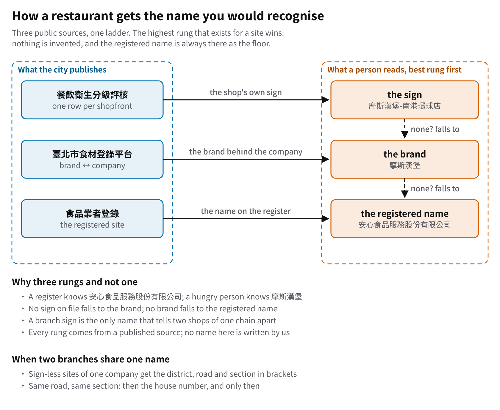

| 來源 | 筆數 | 比例 |
|---|---|---|
| 招牌 | 1,363 | 3.7% |
| 品牌（只限單一品牌的公司） | 4,003 | 11.0% |
| 登記名稱（其餘） | 31,010 | 85.2% |

也試過開放的全球地點資料 Overture Maps，最後放棄：只有 39.5% 配對可信，只靠地址串接時有 46% 配錯。

### 資料模型

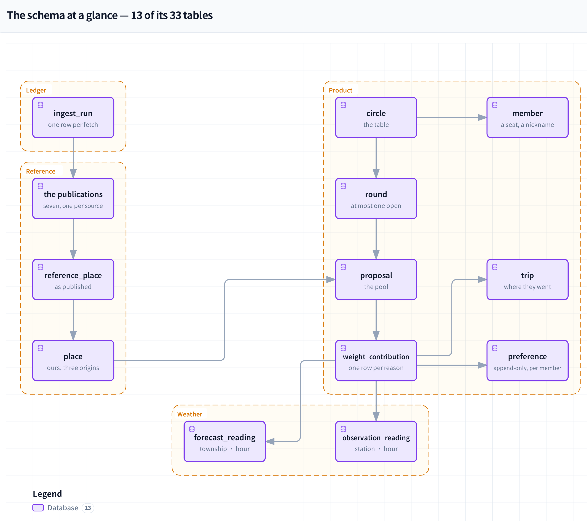

正式站資料庫 **490 MB**：35,965 家店，其中 25,031 家已經有分類。來源資料表會把每一版發布並排保留，新檔案進來是整份新增，不會蓋掉上一版。

| 資料表 | 筆數 | 內容 |
|---|---|---|
| `place` | 35,965 | 圈子可以選的店 |
| `reference_place` | 72,963 | 政府主清單，兩個版本（36,376 筆與 36,587 筆） |
| `storefront_name` | 1,686 | 稽查員記下的招牌 |
| `brand_registration` | 288 | 公司 ↔ 品牌對照 |
| `business_tax_row` | 363,412 | 稅籍名稱與行業代碼 |
| `business_status_row` | 419,896 | 商業登記狀態 |
| `forecast_reading` | 970,190 | 鄉鎮預報 |
| `observation_reading` | 136,800 | 測站觀測 |
| `ingest_run` | 1,766 | 每次匯入一筆，「沒有變動」也算 |

骰子用到的每個權重都存成一筆資料，並連回計算它時用的那筆原始資料。AI agent 也能透過資料血緣工具查「這個數字從哪來」（[見下方](#給-ai-agent-用的工具透過-mcp-查資料血緣)）。

## 分類模型與評估

### 模型在做什麼

沒有任何公開資料會寫一家店賣什麼。所以由本機模型讀取管線裡最好的店名，從十三個料理類別（麵食、火鍋、日式、咖啡飲料……）挑一個。不在這十三個裡的答案一律不收。

做法是 RAG，三個步驟：

- **檢索（Retrieval）：** pgvector 找出五個最相似、已經標註好的店名。
- **增強（Augmented）：** 把它們當作範例放進 prompt，旁邊是要分類的店名。
- **生成（Generation）：** `gemma2:2b` 回答一個類別。

模型不懂的地方，就補標註範例進去；prompt 和模型權重都不動。

### 怎麼評分

**一份固定的 200 筆測試集**：依各類別比例只抽一次、人工標註，每一輪都用同一份。指標是**正確率**：模型答的類別和人工標註一致的比例。每個候選模型都只跑一次，走的是跟每晚排程一樣的流程。

| 模型 | 授權 | 200 筆正確率 |
|---|---|---|
| `qwen2.5:7b-instruct` | Apache-2.0 | **72.0%** |
| `gemma2:2b`（使用中） | Gemma terms | 71.0% |
| `llama3.2:3b` | Llama 3.2 community | 70.5% |
| `qwen2.5:3b-instruct` | 研究授權，僅供評估 | 65.5% |

**為什麼用 2B：** 前三名差不到 2 分，7B 每筆的成本卻是三倍。這份測試集也抓到一次「prompt 改得比較好讀，分數卻掉了」（51.5 → 49.5）。

**檢索的效果要每個模型分開量**，同一批範例對某個模型有幫助，對另一個卻是干擾：在前一版測試集上，檢索讓 `gemma2:2b` 從 51.5 升到 61.0、`llama3.2:3b` 從 37.0 升到 58.0，`qwen2.5:3b` 卻從 51.0 掉到 48.5。

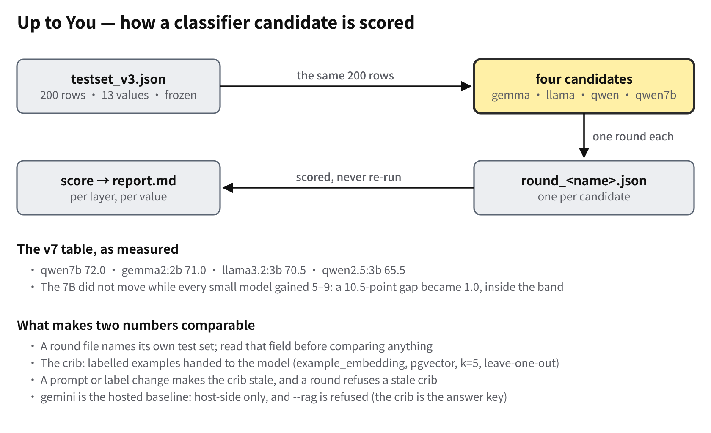

向量模型也用同樣方式篩選（拿最近鄰的標註當答案，留一法）：

| 向量模型 | 正確率 |
|---|---|
| `snowflake-arctic-embed2`，不加前綴（使用中） | **55.0%** |
| `snowflake-arctic-embed2`，加官方 `query:` 前綴 | 53.5% |
| `e5`，加 `query:` | 51.5% |
| `0.6b`，加指示語 | 51.5% |

### 為什麼在本機跑

- **額度：** 雲端模型免費方案一天 500 次，3,300 家店要跑一個禮拜；本機一個晚上就跑完。
- **資料：** 店名不會離開這台機器。
- **不在乎延遲：** 分類是半夜的批次工作，沒有人在等。

全臺北 **36,014 筆，10.5 小時**跑完，用一張 8 GB 顯示卡（每筆 0.92 秒；同一台機器只用 CPU 要 12–19 秒）。正式站本身不跑任何模型。

### 官方行業代碼能幫多少

稅籍資料有行業代碼。但某連鎖咖啡的 245 家分店登記的是批發業代碼，只看代碼會全部分錯。所以代碼只在明確的時候採用（佔全市 10.9%），其餘交給模型。

### 給 AI agent 用的工具：透過 MCP 查資料血緣

一個走 stdio 的 MCP server，讓 agent 不用寫 SQL 就能問「這個數字從哪來」。六個工具會回答：某筆預報在哪裡發布、某筆觀測從哪來、一次擲骰的每個權重讀了哪些資料、某次匯入做了什麼、某個來源的歷史、某次發布的細節。它用自己的資料庫角色連線，只能讀十二張表。第七個工具 `explain_place_loss` 存在的目的就是拒絕：一家店為什麼輸，牽涉到成員的私人偏好，所以這條界線直接列出來，讓 agent 看得到。

## 資料庫裡的抽籤與隱私

**抽籤結果在第一個人提案前就固定了**：開局時先公開種子的雜湊值，結束時公開種子本身，兩者都跟著結果一起回傳，圈子裡任何人都能對照開局時固定的內容檢查。每個因素在這一輪結束時寫成一列；操作者的收據直接讀回這些列，不重算。

**隱私在資料庫層把關。** 一輪結束時，觸發器會在儲存結果的同一個交易裡，抹掉「誰提了哪家」。寫入偏好不發出任何事件，因為人少的時候，從事件發生的時間點就能猜出是誰。每晚的清除工作用一個只能動那張表的角色，刪掉沒用到的偏好。

## 系統架構

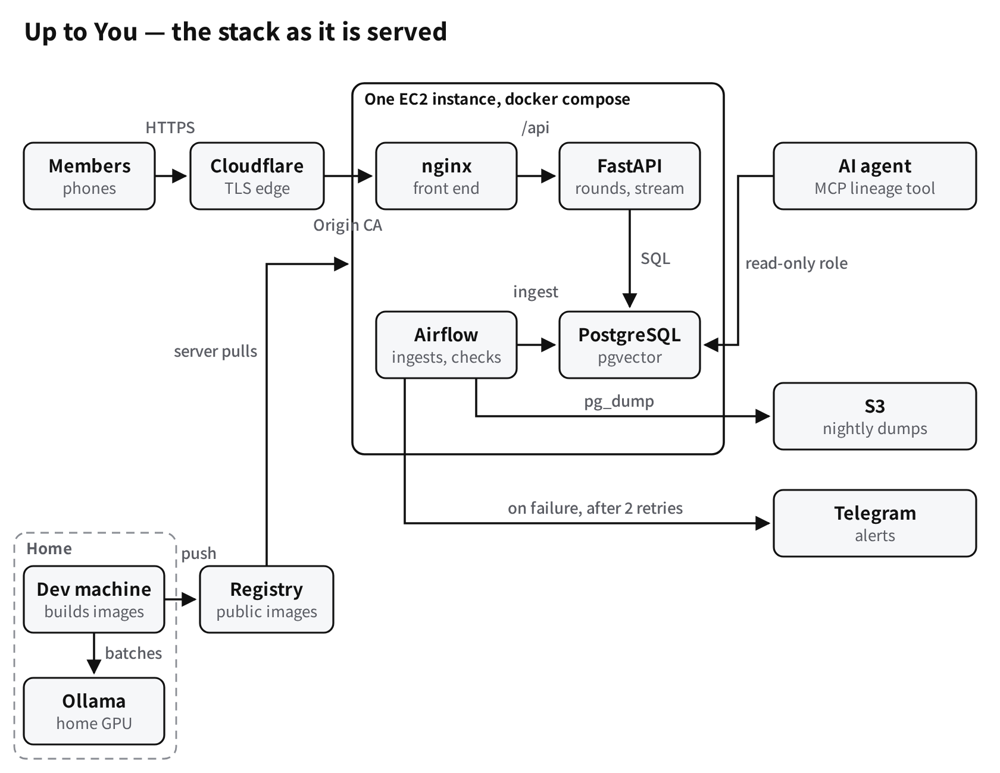

**一台小 EC2、一個 compose 檔、一個 PostgreSQL**，同時處理關聯查詢和向量搜尋，不用為了向量另外維護、備份一套服務。

| 層 | 用什麼 |
|---|---|
| **前端** | Vite + React 19 + Tailwind 4 + shadcn/ui，在 proxy 映像檔裡建置。執行時不從第三方 CDN 抓任何東西；建置好的檔案由 Cloudflare 在各地快取。兩套字型只保留頁面用到的字。 |
| **API** | Python、FastAPI、SQLAlchemy，全程 async；50 個手寫的 Alembic migration（觸發器、權限、CHECK 約束）。 |
| **資料庫** | PostgreSQL 17 + pgvector。七個登入角色，一個工作一個：API、匯入、清除、備份、血緣工具、數值檢查，以及只有一次性 migration 容器會用到的 owner。 |
| **排程** | Apache Airflow 3，LocalExecutor，在同一個 compose 裡。 |
| **模型** | 家裡一張 8 GB 顯示卡上的 Ollama，只在手動啟動的批次執行；正式站不跑模型。 |
| **部署** | AWS 的 EC2，前面接 Cloudflare（Full strict）。主機只拉已發布的映像檔，自己不建置，也沒有人能推東西進去。API 啟動時發現資料庫版本不對，就直接退出，不會帶著錯的版本上線。 |

### 測試與 CI

上面的 CI 徽章在每次公開 commit 時執行：**不需要資料庫的測試**（只用標準函式庫）、**前端建置加型別檢查與 lint**、**用全新 clone 的角度讀 compose 檔**。完整測試共 76 個檔案，分兩種：不連網的主機端測試，以及自己建資料庫、測完就丟的測試。每次 commit 前還有七道本機檢查（密鑰、哪些檔案可以離開 app/、字型、使用者看得到的伺服器訊息與狀態表、Python 等）。

## 效能

| 項目 | 改善前 | 改善後 | 量測條件 |
|---|---|---|---|
| 當晚沒有新檔（主清單） | 15.0 秒 | **1.6 秒** | 執行紀錄，8 天 |
| 一個店名轉向量 | 0.481 秒 | **0.045 秒** | 100 個店名，各跑兩次 |
| 分類一個店名 | CPU 12–19 秒 | **8 GB 顯示卡 0.92 秒** | 一個行政區，1,318 筆 |
| 稅籍名冊匯入的記憶體高峰 | 172 MB | **77 MB** | 2 GB 主機 |
| 整套服務閒置時的記憶體 | 1,131 MiB | **1,009 MiB** | 2 GB 主機 |
| 長時間分類，第一小時 vs 最後一小時 | 約 1.7 倍的時間 | **持平** | 36,014 筆，10.5 小時 |

**店名搜尋沒有用索引，直接掃。** 試過 trigram 索引，31 個真實查詢裡資料庫一次都沒用到。真正慢的是一個子查詢，每打一個字就對候選資料跑 35,533 次。先量，再決定要不要加索引。

[完整版](docs/decisions.md)有每個數字背後的推導。

## 限制與未來方向

**只有臺北**，十二個行政區、一個城市的開放資料。**容量是同時給幾組人用。** 所有來源都在授權範圍內使用，沒有評分、沒有評論、沒有爬蟲。

- **素食改成店家的屬性**（素食麵館 = 麵食 + 有素），因為「我不能吃」是硬性條件，打折不適合。
- **多個 API 執行個體放在負載平衡器後面**：事件匯流排已經搬進資料庫了。
- **用 MLflow 管理評估回合**，取代現在自己記錄的回合檔。
- **「真的有去嗎？」改用交易資料**（POS 或會員系統）會比問大家準，但這類資料要有商業合作，也要符合個資法；目前沒有接洽任何廠商。

## 快速開始

```sh
cp .env.example .env                # 只有變數名稱，註解說明每個值的格式
docker compose run --rm migrate     # 建立資料表，每個版本跑一次
docker compose up -d --wait         # 啟動
curl -s localhost:8080/health
#   {"status":"ok","database":"reachable","instance":"…","stream_listener":"up"}
```

**剛 clone 下來是空的，之後會自己長出資料。** 店家在第一次主清單匯入後出現（半夜自動跑，或[手動執行](docs/operations.md)）。類別要等分類回填，需要顯示卡；沒有顯示卡的話，所有店家都在，只是類別欄位是空的。

`localhost:8080` 就是網站。氣象匯入需要免費的中央氣象署開放資料金鑰（opendata.cwa.gov.tw），其他五個開放資料檔不需要任何憑證。新的排程進來時預設是暫停的。

手動匯入、回填分類、跑測試、使用血緣工具：[docs/operations.md](docs/operations.md)。
